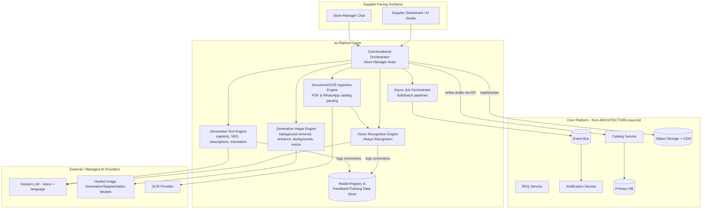
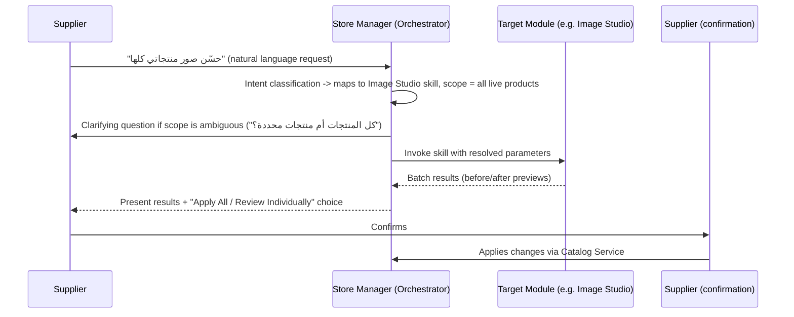
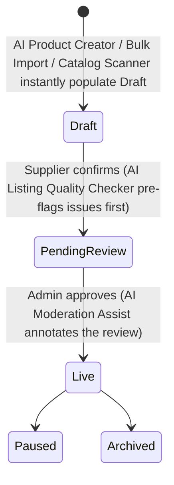

# AI System Design — توق (Touq)

**AI as the Core Competitive Advantage for Supplier Productivity**

| | |
|---|---|
| Version | 1.0 (Draft) |
| Date | 2026-08-08 |
| Companion docs | `docs/PRD-touq.md`, `docs/ARCHITECTURE-touq.md`, `docs/UIUX-touq.md` |
| Scope | AI product & system design only — no code, no model training scripts |

---

## 0. Why AI Is the Moat, Not a Feature

Every risk identified in the PRD traces back to one root cause: **supply-side friction**. Small workshop suppliers don't list professionally because doing so — writing bilingual descriptions, shooting studio-quality photos, keeping a catalog current, answering every RFQ fast — takes time and skills they don't have. That friction is exactly what keeps the market on WhatsApp today.

AI's job on touq is singular: **collapse the time from "I have abayas to sell" to "I have a professional, findable, responsive storefront" from days to minutes.** Three second-order effects follow directly from that:

1. **Supply-side density accelerates** (the platform's hardest bootstrap problem, per the PRD) because free registration + AI tooling removes the *effort* barrier, not just the *cost* barrier.
2. **Every supplier interaction becomes training data.** Every correction a supplier makes to an AI-suggested fabric, color, or caption is a labeled example that improves the shared Abaya Recognition engine (§3.6). Over time this becomes a proprietary, Saudi-abaya-specific visual and language dataset that a horizontal competitor (Alibaba, TradeKey) cannot replicate without years of the same domain-specific volume — this is the actual defensible moat, not any single feature.
3. **Response time and listing quality — the platform's core trust signals** (per the UI/UX design's prominent display of "response time" and "profile completeness") — become AI-assisted by default, which directly improves marketplace-wide conversion and merchant trust without requiring suppliers to become better marketers themselves.

Every module below is designed against one hard rule: **AI drafts, the supplier confirms.** Nothing AI-generated reaches a merchant without an explicit supplier action to accept it — this preserves the trust model the entire platform depends on (see §5).

---

## 1. AI Architecture Overview

AI capabilities are built as a dedicated **AI Platform Layer** sitting alongside the core services defined in `ARCHITECTURE-touq.md`, integrated the same way every other cross-cutting capability is: through the event bus for async triggers, and through internal APIs for direct calls from the Catalog/RFQ services and the app frontends.

**Key architectural decisions:**

- **AI never writes directly to a "live" state.** Every AI output lands as a `draft` (products) or a pending suggestion (captions, prices, translations) inside the existing Catalog/RFQ data model from `ARCHITECTURE-touq.md` — no new lifecycle states are needed, AI simply becomes a very fast way to *arrive* at the existing Draft/Pending Review states.
- **All heavy/batch AI work runs asynchronously** through the same Async Job Orchestrator pattern used elsewhere in the backend (background workers, event-driven, independently scalable from the request-serving API tier) — critical for Bulk Import and Catalog Scanner, which must handle hundreds of images without blocking the supplier's session.
- **One shared Vision Recognition Engine** powers Product Creator, Catalog Scanner, Bulk Import, and (via embeddings) merchant-side visual search — avoiding four separate, drifting implementations of "what does this abaya look like."
- **The Model Registry & Feedback Store is the moat infrastructure**: every supplier correction is captured here (with consent) and periodically used to fine-tune the domain-specific models, per §6.

---

## 2. Shared AI Platform Capabilities ("The Engine Room")

These five engines are the reusable building blocks every module below is composed from — described once here, referenced by name in each module.

| Engine | Function | Underlying approach |
|---|---|---|
| **Vision Recognition Engine** | Extracts structured abaya attributes and a visual-similarity embedding from any product photo | A general-purpose multimodal vision-language model handles open-ended/novel cases at launch; as supplier-corrected labels accumulate in the Model Registry, a lighter, faster, cheaper fine-tuned classifier is trained per attribute (fabric, cut, sleeve, color) and takes over the high-confidence path, with the general model kept as a fallback for ambiguous cases — a deliberate build-then-specialize curve |
| **Generative Image Engine** | Background removal/segmentation, quality enhancement (denoise, upscale, color/lighting correction), generative background replacement, multi-format resizing | Segmentation model isolates the garment; a generative/diffusion-class model composites brand-consistent backgrounds; enhancement uses dedicated super-resolution/denoising models — kept as separate composable steps, not one monolithic "make it pretty" call, so each step can be QA'd and improved independently |
| **Generative Text Engine** | Captions, SEO metadata, hashtags, marketing copy, bilingual translation, price-suggestion narration | An Arabic-capable large language model, prompt-templated per task with touq's brand-voice guidelines (see `UIUX-touq.md` §A.1) baked into the system prompt, with tone controls (luxury / warm / promotional) exposed to the supplier |
| **Document/OCR Ingestion Engine** | Parses PDF catalogs and batches of chat-exported images, segments them into individual product candidates, extracts any embedded text (SKU, price, notes) | OCR (Arabic + Latin script) + a layout/segmentation pass to split multi-product pages/images, handing each isolated product photo to the Vision Recognition Engine |
| **Conversational Orchestrator** | Understands a supplier's natural-language Arabic request and routes it to the correct engine(s)/module(s) as callable tools, holding short-term session context | An LLM-based agent with function-calling access limited to a fixed, safe set of platform actions (see §3.7) — never given open-ended data access, only the specific tool calls each module exposes |

---

## 3. The Seven Core AI Modules

### 3.1 AI Product Creator — *Generate Products from Images*

**Purpose:** turn one or more photos into a ready-to-review product listing in seconds instead of the 10–15 minutes of manual form-filling that currently discourages small suppliers from listing at all.

**Workflow:**
1. Supplier uploads one photo (quick add) or several photos of the same garment from different angles/colors (multi-variant add) from the Supplier Dashboard or Store Manager.
2. Vision Recognition Engine extracts the full attribute set (§3.6) with per-attribute confidence.
3. Generative Text Engine drafts a bilingual title and description from the extracted attributes.
4. Generative Image Engine auto-runs a light enhancement pass (background clean-up) on the source photos so the draft never looks worse than what the supplier uploaded.
5. A **Draft Product Review** screen presents every field pre-filled: high-confidence attributes shown as normal filled fields, low-confidence attributes visually flagged (per §5) for the supplier to confirm or correct, pricing tiers left blank (supplier-owned decision, never AI-guessed without an explicit price-suggestion request — see §4.9).
6. Supplier edits as needed and submits — entering the existing **Pending Review** state from the product lifecycle unchanged.

**UI touchpoint:** primary entry point inside the Supplier Dashboard ("Add Product" → "AI Create from Photos"), and directly callable from the Store Manager via "Create products."

---

### 3.2 AI Image Studio — *Remove Background, Improve Quality, Luxury Backgrounds, Social Sizes*

**Purpose:** give every supplier — regardless of whether they can afford a photographer — output that matches touq's premium visual bar (per `UIUX-touq.md` §A.1), directly raising marketplace-wide trust and conversion.

**Capabilities (each independently selectable, and independently toggle-able per photo):**

| Capability | What it does | Notes |
|---|---|---|
| **Background removal** | Isolates the garment from its original background (bedroom walls, cluttered workshop tables, patterned fabric backdrops) onto a clean transparent/white canvas | First step for every other capability in this module |
| **Quality improvement** | Denoising, sharpening, upscaling low-resolution phone photos, lighting and color correction/white-balance | Restores true fabric color — critical since accurate color is a core Recognition attribute and a common source of merchant disputes |
| **Luxury backgrounds** | Composites the isolated garment onto a curated set of on-brand generated backdrops (ivory studio sweep, sand/marble tones, soft editorial gradients matching the touq palette) | Supplier picks from a style gallery or leaves it to "Auto-select best match" |
| **Social media sizes** | Batch-exports every processed image into preset formats: Instagram post (1:1), Instagram/Snapchat story (9:16), WhatsApp status, marketplace thumbnail, print-catalog resolution | Feeds directly into the AI Marketing Kit (§3.3) and Store Manager's "Generate social media" skill |

**Workflow:** select photo(s) → choose capabilities (or "Enhance All" one-click preset) → before/after preview per image → accept or revert per image (original is always retained, never overwritten) → apply to product.

**Guardrail:** image edits are strictly scoped to *background, lighting, and framing* — the garment itself (color, shape, embroidery) is never generatively altered, and every enhanced image carries an internal "AI-enhanced" flag so the platform can always produce the original on request (dispute resolution, trust).

---

### 3.3 AI Marketing Kit — *Captions, SEO, Hashtags, Marketing Copy*

**Purpose:** give suppliers (and, by extension, the merchants reselling their products) ready-to-use marketing assets without hiring a copywriter.

**Outputs, generated per product or in batch across a selection:**

| Output | Description |
|---|---|
| **Social captions** | Short bilingual captions (AR primary/EN optional) in a selectable tone (luxury / warm-personal / promotional/sale), sized appropriately per platform (Instagram, Snapchat, TikTok) |
| **SEO metadata** | Title tag and meta description suggestions optimized for how merchants search on touq and, longer-term, useful as-is inside a merchant's own Salla/Zid storefront (a natural touchpoint for the future Zid/Salla integration) |
| **Hashtags** | A ranked set mixing broad Saudi/Gulf fashion tags with niche abaya-specific and product-attribute tags (e.g., fabric/style-derived) |
| **Marketing copy** | Longer-form copy for ad placements, WhatsApp broadcast messages, and seasonal campaign text (Ramadan/Eid variants) |

**Workflow:** select one product or a multi-select batch → choose tone preset → generate → edit inline → copy to clipboard or (future) push directly to a connected channel (WhatsApp Business, social — see `ARCHITECTURE-touq.md` §14 future integrations).

---

### 3.4 AI Catalog Scanner — *Read PDF Catalogs and WhatsApp Images, Generate Products Automatically*

**Purpose:** let a supplier import their *existing* offline catalog — a PDF lookbook or a folder of images they've been sending over WhatsApp for years — instead of starting from zero on the platform.

**Workflow:**

**Handling messy real-world input:**
- A single PDF page or WhatsApp export often shows multiple products (a grid of photos) — the Ingestion Engine's layout/segmentation step splits these before attribute extraction runs.
- Embedded price tags/handwritten notes on the image (common in supplier WhatsApp catalogs) are OCR'd and offered as a suggested starting price tier, never auto-applied.
- Because WhatsApp-exported media can include unrelated chat images, the ingestion step first runs a lightweight "is this an abaya product photo" filter before running full attribute extraction, discarding non-product images from the batch automatically (with a visible "N images skipped, not recognized as product photos" note).

**Output:** identical Bulk Draft Review experience to AI Bulk Import (§3.5) — the two modules converge into the same review UI once ingestion is complete, since both end in "a queue of AI-drafted products awaiting confirmation."

---

### 3.5 AI Bulk Import — *Upload Hundreds of Images, Generate Products Automatically*

**Purpose:** the highest-leverage onboarding tool for a mid-size factory (the "Abu Turki" persona) with an existing large product photo library and no patience for one-by-one entry.

**Workflow:**
1. Drag-and-drop or folder upload of up to several hundred images at once (chunked upload with resumability for large batches).
2. **Clustering step**: the Vision Recognition Engine's embeddings group visually similar photos (different angles/lighting of the same garment) into single product candidates, rather than creating one product per image — flagged clusters below a confidence threshold are left as individual candidates for the supplier to manually merge/split in review.
3. Each cluster proceeds through the same attribute-extraction and draft-assembly pipeline as Product Creator, running as background jobs across the whole batch.
4. **Live progress view**: "processed 245 of 500 images," with completed draft product cards populating a review grid in real time rather than the supplier waiting for the entire batch.
5. **Bulk Draft Review**: grid of drafted products with checkboxes; actions — Approve Selected, Edit Individual, Discard, and an AI-flagged **"possible duplicate"** badge (near-identical embeddings to an existing live product) to prevent catalog clutter.
6. Approved drafts proceed into Pending Review exactly as any manually created product would.

**Scale note:** this is the module most dependent on the async, horizontally-scalable job infrastructure defined in `ARCHITECTURE-touq.md` §7.4 — GPU-backed inference workers scale independently of the request-serving API tier specifically to absorb these bursty, large-batch workloads (e.g., a factory's initial onboarding, or a pre-Ramadan catalog refresh).

---

### 3.6 AI Abaya Recognition — *The Shared Detection Engine*

**Purpose:** the single computer-vision capability every other supplier-facing AI module (and the future merchant-facing visual search) is built on. Given one product photo, it returns a structured, confidence-scored attribute set.

| Attribute | Example values | Notes |
|---|---|---|
| **Fabric** | Nada, Crepe, Japanese crepe, Chiffon, Korean fabric, Cotton blend, Silk-blend, Linen | Feeds Season inference |
| **Style/Cut** | Classic (closed), Open-front (farasha/butterfly), Kimono, Wrap, Layered | Maps directly to the Marketplace filter taxonomy (`ARCHITECTURE-touq.md` §2.3 `attribute_definitions`) |
| **Sleeves** | Fitted/narrow, Wide/bell, Dolman, Batwing, Cuffed, Ruffled | |
| **Color** | Primary color + secondary/accent color (trim/embroidery color) | Normalized to a fixed brand color taxonomy so Marketplace color-swatch filters stay consistent across suppliers |
| **Embroidery** | None, Chest, Sleeve, Hem, All-over, Beadwork/crystal detailing, Printed pattern (distinguished from embroidery) | Includes rough placement, not just presence/absence |
| **Category** | Everyday/Casual, Occasion/Formal, Bridal, Prayer Abaya | Feeds Marketplace category browsing |
| **Season** | Lightweight/Summer, Mid-weight/Transitional, Heavyweight/Winter | Inferred from fabric + color signals, always shown as a suggestion, never a hard constraint |

**Confidence-gated UX (applies everywhere this engine's output surfaces):** each attribute renders with one of three treatments — **Auto-filled** (high confidence, editable but not flagged), **Suggested** (medium confidence, visually marked "AI suggestion — confirm"), or **Needs input** (low confidence, left blank with a placeholder prompting the supplier). This single pattern is what keeps AI assistance fast without letting low-confidence guesses reach a live listing unreviewed.

**This engine is also the foundation for:**
- Merchant-facing **visual search** ("find similar," §4.7)
- Admin-side **moderation assist** — flags likely category mismatches or policy-relevant content for the verification/moderation queue (§4.8)
- The **duplicate/quality checker** (§4.6)

---

### 3.7 AI Store Manager — *Arabic Conversational Assistant*

**Purpose:** a single Arabic-first natural-language interface that lets a supplier — including the least tech-comfortable persona in the PRD ("Umm Faisal," low digital literacy) — operate every AI module by simply describing what they want, by typing or by voice.

**Architecture:** the Store Manager is **not a separate AI system** — it is the Conversational Orchestrator (§2) sitting on top of the same six modules above, exposed as a fixed set of callable "skills." This is a deliberate constraint: the assistant can only do what the platform's defined tools allow, which keeps its behavior predictable and auditable rather than open-ended.

| Supplier says (Arabic, examples) | Skill invoked | Underlying module |
|---|---|---|
| "أنشئ منتجات" (Create products) | Prompts for photo upload, then runs | AI Product Creator (§3.1) |
| "حسّن الصور" (Improve photos) | Runs on newly uploaded or selected existing catalog photos | AI Image Studio (§3.2) |
| "أنشئ كتالوج" (Generate a catalog) | Compiles a branded, shareable PDF/image catalog of the supplier's live products — a bonus *export* capability distinct from the *import*-focused Catalog Scanner, doubling as a ready-to-forward WhatsApp sales asset | Generative Text + Image Engines, new "Catalog Export" composition step |
| "أنشئ محتوى لمواقع التواصل" (Generate social media) | Batch-runs Image Studio social-size export + Marketing Kit captions across selected products | AI Image Studio + Marketing Kit (§3.2, §3.3) |
| "ترجم المنتجات" (Translate products) | Bilingual field translation (AR↔EN) across selected products, supplier reviews before applying | Generative Text Engine |
| "اقترح أسعار التجزئة" (Suggest retail prices) | Runs the AI Pricing Intelligence skill (§4.9) and returns a suggested merchant resale price range alongside the supplier's own wholesale tiers | AI Pricing Intelligence |

**Workflow pattern (every skill follows this shape):**

**Design details:**
- **Voice input** (Arabic speech-to-text) is supported alongside typed chat — directly serving the lower-literacy supplier persona, for whom describing a product ("عباية كريب لون كحلي بأكمام واسعة") may be faster and more natural than a form or even a photo upload.
- **Proactive nudges**, not just reactive replies: the Store Manager surfaces suggestions unprompted based on catalog health (e.g., "لاحظت 5 منتجات بدون صور محسّنة، هل تحسّنها الآن؟" — "I noticed 5 products without enhanced photos, improve them now?"), tying directly into the Supplier Dashboard's performance widget from `UIUX-touq.md` §C.5.
- **Confirm-before-mutate is absolute**: exactly like every other module, the Store Manager only *proposes*; every action that changes catalog data requires an explicit supplier confirmation step, even when invoked conversationally.

---

## 4. Additional AI Modules — Built to Make Suppliers (and Merchants) Excited

Beyond the seven requested modules, these extend the same shared engines into high-excitement, high-retention features:

### 4.1 AI Virtual Try-On / Ghost Mannequin Visualization
Most small workshops photograph abayas flat or on a hanger — never on a model, for cultural and logistical reasons. This module generates a realistic "as-worn" visualization from a flat/hanger photo, dramatically improving how the garment is perceived without requiring a real photoshoot or model. Presented as an optional, clearly-labeled "AI visualization" alongside the real product photos — never a replacement for them, to keep the "what you see is what you get" trust guarantee intact.

### 4.2 AI Seasonal Campaign Generator
One click compiles a full Ramadan/Eid (or wedding-season) campaign kit from a supplier's existing live catalog: a themed banner set, matching social captions, and a WhatsApp broadcast message — directly mitigating the seasonality risk flagged in the PRD by making it effortless for suppliers to capitalize on demand spikes.

### 4.3 AI RFQ Quote Assistant
When an RFQ arrives, the assistant drafts a suggested quote reply based on the supplier's own historical pricing for that product/variant and current stock/lead time — the supplier reviews and sends with one tap instead of composing a quote from scratch. Directly improves the **response-time metric** that drives marketplace ranking and merchant trust (`ARCHITECTURE-touq.md` §2.2, `UIUX-touq.md` §C.5).

### 4.4 AI Trend & Demand Insights
Aggregated, anonymized marketplace signals ("Butterfly-cut abayas in emerald are trending +34% in Riyadh this month") surfaced on the Supplier Dashboard's Insights area, turning platform-wide RFQ and search data into a forward-looking production signal — directly realizes the "AI-powered demand forecasting" item already listed as a Future Feature in the PRD, now given a concrete design.

### 4.5 AI Voice Product Entry
A standalone entry point (also reachable via the Store Manager, §3.7) where a supplier describes a product entirely by speaking in Arabic (including dialect), and the system drafts the product from the transcription plus any attributes mentioned — a zero-typing, zero-photo path for the least tech-comfortable suppliers, usable as a starting point even before photos are ready.

### 4.6 AI Listing Quality & Duplicate Checker
Runs automatically before a supplier submits any product for review: flags blurry/low-resolution images, incomplete attribute sets, and likely duplicates of the supplier's own existing listings (via the same embedding comparison used in Bulk Import) — reducing the back-and-forth rejection cycle with Admin moderation and keeping the marketplace catalog clean as it scales.

### 4.7 AI Visual Search (Merchant-Facing)
A merchant uploads a reference photo (an Instagram screenshot, a photo of an abaya they liked) and the same Vision Recognition embeddings power a "find similar products across all suppliers" search — a merchant-facing differentiator no competitor's text-only wholesale catalog can offer, built entirely on infrastructure already required for the supplier-side modules.

### 4.8 AI Moderation Assist (Admin-Facing)
Every product entering the Pending Review queue (`ARCHITECTURE-touq.md` §11) is pre-screened: likely category mismatches, potential IP/counterfeit concerns (visual similarity to known designer cuts flagged for human judgment, never auto-rejected), and image policy issues are surfaced to the Admin reviewer as annotations — speeding up the verification/moderation queue without removing the human decision, directly addressing the "trust & fraud" and "counterfeit" risks in the PRD.

### 4.9 AI Pricing Intelligence
Two related capabilities: **wholesale benchmarking** for suppliers (how their tiered pricing compares, anonymized, to similar products by fabric/style/region) and **suggested retail pricing** for merchants/suppliers (a recommended resale price band based on typical wholesale-to-retail margins in the category) — directly realizes the PRD's "Data & insights subscription" revenue stream (§2.2) as an AI-native product rather than a static report.

---

## 5. Human-in-the-Loop & Trust Guardrails (Cross-Cutting Policy)

These rules apply to every module above without exception, because the platform's entire value proposition rests on merchant trust in what they see:

1. **AI drafts, humans confirm.** No AI output reaches a live, merchant-visible state without an explicit supplier action (§0). This is enforced structurally — AI services only have write access to `draft`-state records, never to `live` records, mirroring the RBAC ownership model from `ARCHITECTURE-touq.md` §5.
2. **Confidence is always visible.** The three-tier Auto-filled / Suggested / Needs-input treatment (§3.6) is used consistently across every module that presents an AI output for review — a supplier should never be unsure whether they're looking at a fact or a guess.
3. **The garment is never generatively altered.** Image Studio and Virtual Try-On operate on background, lighting, framing, and pose visualization only — color, print, embroidery, and cut of the actual photographed garment are never invented or changed, and the original unedited photo is always retained and retrievable.
4. **AI-enhanced content is internally flagged** (enhanced images, AI-drafted copy) so Admin moderation and dispute resolution can always distinguish AI-assisted from fully manual listings if a dispute requires it.
5. **The Store Manager's action surface is a fixed allow-list**, not open-ended data or code access — it can only invoke the specific module skills defined in §3.7, each of which independently enforces rules 1–4.
6. **A sampling-based quality audit** on AI-generated text and images (independent of individual supplier review) feeds back into prompt/model tuning — catching systematic issues (e.g., a recurring mistranslation, an unrealistic background style) before they compound across many listings.

---

## 6. Data & Continuous Learning Strategy (The Moat)

- **Consent-based learning loop**: when a supplier corrects an AI suggestion (re-labels a fabric, edits a generated caption, discards a bad background), that correction — with the original input and the correction — is captured in the Model Registry & Feedback Store as a labeled training example, under the same PDPL-compliant data handling defined in `ARCHITECTURE-touq.md` §16.
- **Build-then-specialize model curve**: launch on general-purpose hosted vision/language models for immediate coverage across the full attribute taxonomy; as volume accumulates per attribute, train lighter, cheaper, faster fine-tuned classifiers specific to Saudi/GCC abaya fabrics, cuts, and embroidery styles — a distinction no generic model, however large, will match without the same domain-specific volume.
- **This dataset compounds as a genuine moat**: the more suppliers use touq's AI tools (which they're incentivized to do because the tools save them real time), the better and cheaper the platform's own recognition and generation get relative to any new entrant starting from zero — directly reinforcing the supply-side flywheel described in §0.
- **Model versioning**: every production model is registered with a version, evaluation metrics, and rollback path — routine MLOps discipline that lets recognition/generation quality improve continuously without risking regressions on a live marketplace.

---

## 7. AI's Role in the Product & Order Lifecycle

AI does not introduce new lifecycle states into the Product or Order state machines defined in `ARCHITECTURE-touq.md` §10–§11 — it accelerates reaching the existing ones:

On the RFQ/Order side, the **AI RFQ Quote Assistant** (§4.3) shortens the Submitted → Viewed → Quoted transition without changing the state machine itself — it is purely a drafting aid at the "Quoted" step.

---

## 8. AI Monetization & Plan Tiers

AI usage extends, rather than replaces, the Business Model defined in `PRD-touq.md` §2:

| Tier | AI allowance (illustrative) |
|---|---|
| **Free (all suppliers, since registration is free)** | Core AI Product Creator, Image Studio (standard enhancement), and Abaya Recognition available with a monthly usage allowance — enough to fully onboard a small workshop's catalog |
| **Supplier Pro (paid upsell)** | Unlimited Product Creator/Image Studio usage, luxury background packs, AI Marketing Kit, Bulk Import/Catalog Scanner, Store Manager voice input, Seasonal Campaign Generator |
| **Merchant Pro/Enterprise** | AI Visual Search, AI Pricing Intelligence (retail price suggestions), Trend & Demand Insights |

This gives the platform a natural, usage-graded upgrade path that maps directly onto the "featured placement / Pro supplier badge" monetization sequencing already recommended in the PRD — AI capability becomes a second, complementary lever on the same free-to-paid supplier journey, rather than a new, disconnected pricing model.

---

## 9. Success Metrics

| Metric | What it tells us |
|---|---|
| % of live products created via an AI module vs. fully manual entry | Core adoption signal |
| Average time-to-first-live-listing for a new supplier | Direct measure of the "days to minutes" goal in §0 |
| AI suggestion acceptance rate (accepted as-is vs. edited vs. discarded), per attribute and per module | Quality signal that also drives the fine-tuning priority queue (§6) |
| Supplier RFQ response time, before vs. after Quote Assistant adoption | Ties AI directly to the trust/ranking metric it's designed to improve |
| % of suppliers using Image Studio before first publish | Leading indicator of marketplace-wide photo quality, which drives merchant conversion |
| Admin moderation queue turnaround time, before vs. after Moderation Assist | Operational efficiency gain |

---

## 10. AI-Specific Risks & Mitigations

| Risk | Mitigation |
|---|---|
| Hallucinated product claims (e.g., incorrect fabric composition stated confidently) | Confidence-gated UX (§3.6) plus mandatory supplier review before any listing goes live — no AI-authored factual claim reaches "Live" unconfirmed |
| Generated imagery misrepresenting the actual product | Garment-alteration ban (§5, rule 3); Virtual Try-On explicitly labeled as a visualization, never a primary listing photo |
| Bias/accuracy gaps across less common styles (e.g., regional or occasion-specific cuts underrepresented in early training data) | Confidence thresholds route unfamiliar cases to "Needs input" rather than a confident wrong guess; the feedback loop (§6) specifically prioritizes underrepresented categories for labeling |
| Cost overrun from heavy generative image/video usage at scale | Tiered AI allowances (§8) and async batch processing keep expensive operations bounded and billable rather than unlimited by default |
| Privacy exposure from WhatsApp-exported media (may contain non-product personal images) | Catalog Scanner's pre-filter discards non-product images before any further processing (§3.4); only product-relevant image data is retained, per PDPL data-minimization principles from `ARCHITECTURE-touq.md` §16 |
| Over-automation eroding merchant trust in "real" listings | The AI-enhanced flag and original-photo retention (§5, rules 3–4) keep every enhancement auditable and reversible |

---

## 11. Future AI Roadmap

Sequenced to match the platform's own phased roadmap in `PRD-touq.md` §11:

- **Phase 1–2 (MVP → Trust Foundations)**: AI Product Creator, Image Studio (background removal + enhancement), Abaya Recognition, Store Manager (core skills: create, improve photos, translate).
- **Phase 2–3**: Marketing Kit, Catalog Scanner, Bulk Import, Listing Quality Checker, RFQ Quote Assistant — the batch/scale tools, timed to land alongside the platform's own logistics/analytics maturity.
- **Phase 3–4**: Trend & Demand Insights, Pricing Intelligence, Seasonal Campaign Generator, Moderation Assist — features that need marketplace-wide data volume to be useful.
- **Phase 4+**: Virtual Try-On, Visual Search, Voice Product Entry at full maturity, and — once regional expansion begins — extending the Generative Text Engine's translation/localization beyond AR/EN to other GCC-market needs.
