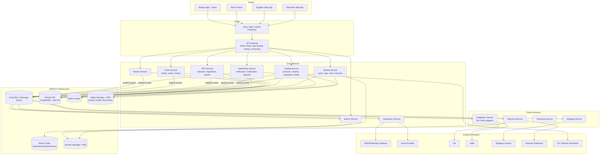
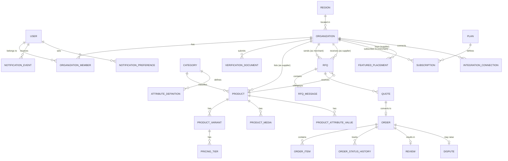
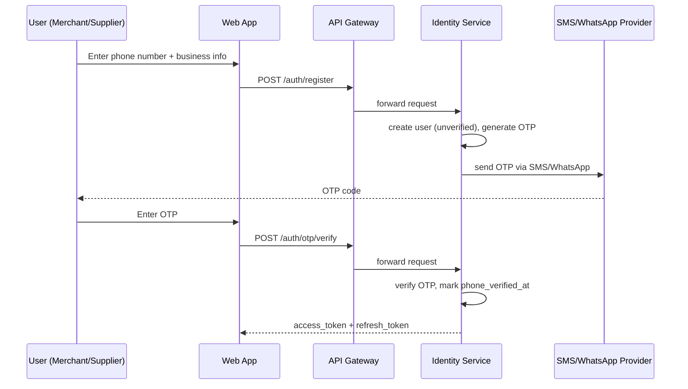
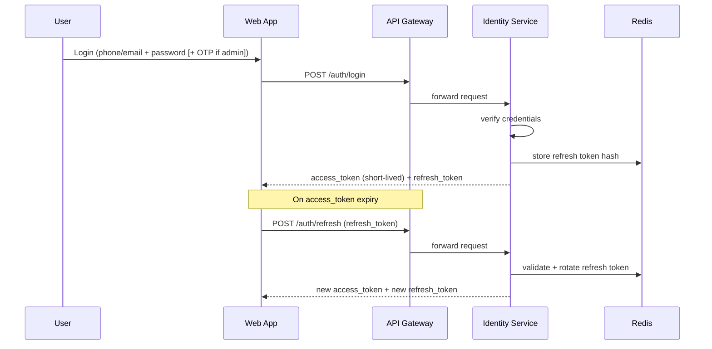
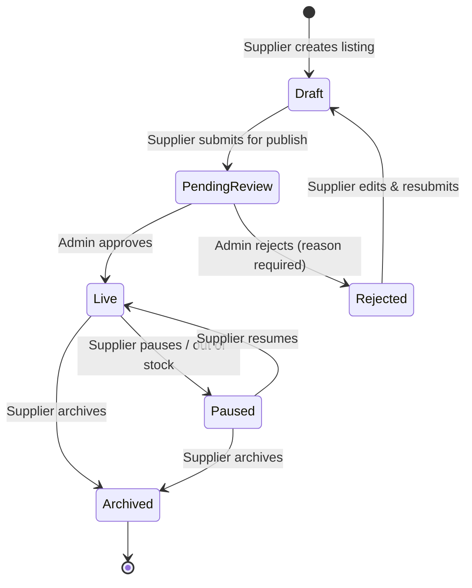
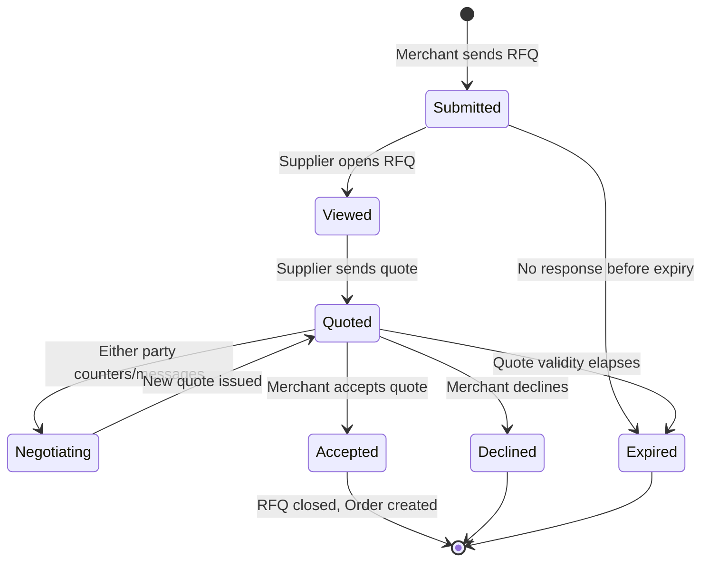
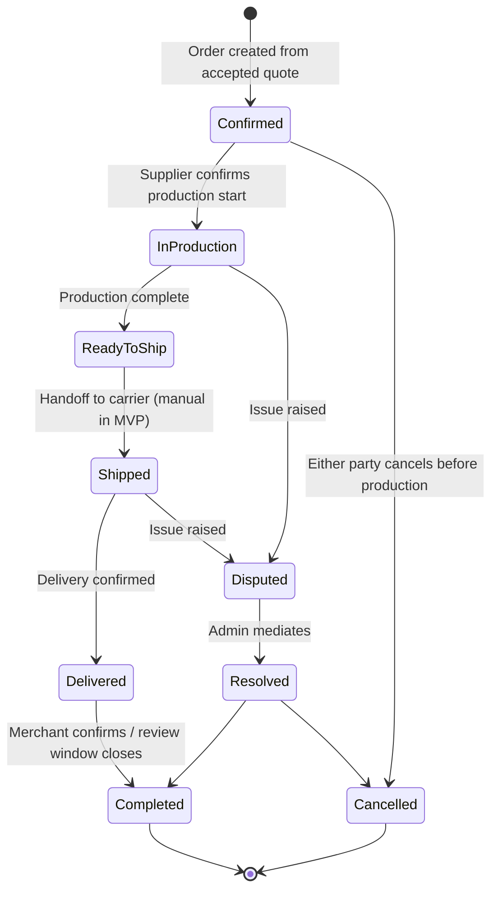
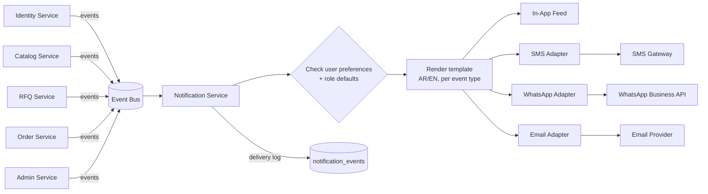

# System Architecture — توق (Touq)

**B2B Wholesale Marketplace for Abayas — Enterprise SaaS Architecture**

| | |
|---|---|
| Version | 1.0 (Draft) |
| Date | 2026-08-08 |
| Companion doc | `docs/PRD-touq.md` |
| Scope | Architecture only — no application code |

---

## 0. Architecture Principles

1. **Modular-monolith-first, microservices-ready.** Ship as a small number of well-isolated deployable units with strict domain boundaries, so any module (Catalog, RFQ, Notifications, Search…) can be extracted into its own service later without a rewrite — only an extraction of an already-isolated module.
2. **Single source of truth, eventually-consistent read models.** The relational database is the system of record. Search, caching, and analytics are derived, rebuildable read models fed by events — never the other way around.
3. **Event-driven core.** Domain state changes (RFQ created, quote accepted, order status changed, supplier verified) are published as events. Notifications, search indexing, analytics, and future integrations all subscribe — this is what lets the platform add channels/integrations without touching core business logic.
4. **API-first.** Every client (merchant web, supplier web, admin panel, future mobile apps, future Salla/Zid integrations) consumes the same versioned public/internal API — no direct DB access from any frontend.
5. **Stateless services, stateful stores.** All application services are horizontally scalable and hold no local state; state lives in the database, cache, object storage, and queues.
6. **Design for KSA data residency and PDPL compliance from day one**, not retrofitted later.
7. **Everything is multi-tenant-safe by construction**: every row that belongs to a supplier or merchant organization carries an explicit `org_id`/owner reference and is authorized at the query layer, not just the UI layer.

---

## 1. High-Level System Architecture



**Reading this diagram:** clients never talk to services or the database directly — everything passes through the CDN/WAF and API Gateway. Services never call each other synchronously for non-critical side effects (e.g., Order Service does not call Notification Service directly); they publish an event to the bus and the interested service reacts. This is what keeps the system scalable and lets new integrations (Zid, Salla, shipping, payments) plug in as new event subscribers without modifying core services.

---

## 2. Database Design

### 2.1 Design Conventions

- **Primary keys**: UUID (v7/time-ordered preferred) on every table — avoids sequential-ID enumeration attacks and simplifies future multi-region/multi-service data ownership.
- **Every table** carries `created_at`, `updated_at`; mutable business entities also carry `created_by`/`updated_by`.
- **Soft deletes** (`deleted_at`) on business-critical entities (products, orders, users) — hard deletes are never used where an audit trail or dispute resolution may later need the record.
- **Money fields** stored as integer minor units (halalas) with a separate `currency` column — never floating point.
- **Bilingual content** (AR/EN) stored as paired columns (`title_ar`, `title_en`) rather than a generic i18n table, since only two locales are in scope and query simplicity/performance wins here.
- **Status fields** are enums backed by a small reference table (not free text) so the platform can query/report on lifecycle state safely.
- **Every organization-owned row** (`products`, `rfqs`, `orders`, …) carries an explicit owning `supplier_id`/`merchant_id` foreign key — authorization is enforced at the query/repository layer using this column, never inferred.

### 2.2 Core Schema — Identity & Organizations

| Table | Key Fields | Notes |
|---|---|---|
| `users` | id (PK), email, phone, phone_country_code, password_hash, locale, status (active/suspended), phone_verified_at, email_verified_at, mfa_enabled, last_login_at | Base identity for every human account, regardless of role |
| `organizations` | id (PK), type (supplier/merchant), legal_name_ar, legal_name_en, cr_number, maroof_id, verification_status (pending/verified/rejected), region_id (FK), city, address, logo_url, cover_url, description_ar, description_en, status (pending/active/suspended), rating_avg, rating_count, response_time_avg_minutes | Single table for both supplier and merchant business profiles, discriminated by `type` — simplifies shared features (verification, ratings, staff) |
| `organization_members` | id (PK), organization_id (FK), user_id (FK), role_id (FK), status (active/invited/removed), invited_by | Enables multi-user org accounts (Enterprise tier) from day one, even if V1 only ever creates one owner member per org |
| `roles` | id (PK), name, scope (platform/organization), description | e.g. `platform_admin`, `org_owner`, `org_staff` |
| `permissions` | id (PK), key, description | e.g. `product.write`, `rfq.respond`, `order.view` |
| `role_permissions` | role_id (FK), permission_id (FK) | Many-to-many join |
| `verification_documents` | id (PK), organization_id (FK), doc_type, file_url, status, reviewed_by (FK users), reviewed_at, rejection_reason | CR/Maroof documents, manual review trail |
| `sessions` / `refresh_tokens` | id (PK), user_id (FK), token_hash, device_info, ip_address, expires_at, revoked_at | Supports session listing/"log out of all devices" |
| `regions` | id (PK), name_ar, name_en, parent_id (self-FK) | Country → region → city hierarchy |

### 2.3 Core Schema — Catalog (Abaya-specific)

| Table | Key Fields | Notes |
|---|---|---|
| `categories` | id (PK), parent_id (self-FK), name_ar, name_en, slug | V1 = single "Abaya" root with sub-styles; ready for future category expansion |
| `attribute_definitions` | id (PK), category_id (FK), key, label_ar, label_en, type (enum/text/number), is_filterable | Drives dynamic, category-specific filters (fabric, cut, closure, embroidery) without schema changes per category |
| `attribute_options` | id (PK), attribute_definition_id (FK), value_ar, value_en | e.g. fabric = {nada, crepe, chiffon, korean}, cut = {classic, open, kimono, butterfly} |
| `products` | id (PK), supplier_id (FK organizations), category_id (FK), title_ar, title_en, description_ar, description_en, status (draft/pending_review/live/paused/rejected/archived), rejection_reason, published_at | One product = one design; variants hold sellable specifics |
| `product_attribute_values` | product_id (FK), attribute_definition_id (FK), attribute_option_id (FK) or free value | Structured, filterable product attributes |
| `product_variants` | id (PK), product_id (FK), sku, color, size, moq, lead_time_days, stock_status (in_stock/made_to_order/out_of_stock), status | The actual orderable unit |
| `pricing_tiers` | id (PK), variant_id (FK), min_qty, max_qty (nullable = unbounded), unit_price_minor, currency | Wholesale volume pricing |
| `product_media` | id (PK), product_id (FK), variant_id (nullable FK), media_type (image/video), url, sort_order, is_primary | Stored in object storage, served via CDN |
| `favorites` | merchant_id (FK), supplier_id or product_id (FK), created_at | Saved suppliers/products |

### 2.4 Core Schema — RFQ, Quotes & Orders

| Table | Key Fields | Notes |
|---|---|---|
| `rfqs` | id (PK), merchant_id (FK), supplier_id (FK), product_id (FK), variant_id (FK, nullable), requested_qty, target_price_minor, customization_notes, status (submitted/viewed/quoted/negotiating/accepted/declined/expired/cancelled), expires_at | The purchase request |
| `rfq_messages` | id (PK), rfq_id (FK), sender_user_id (FK), body, attachment_url, created_at | In-app negotiation thread |
| `quotes` | id (PK), rfq_id (FK), supplier_id (FK), quoted_qty, quoted_unit_price_minor, lead_time_days, valid_until, status (pending/accepted/rejected/superseded) | A supplier's formal offer against an RFQ; multiple quotes per RFQ as negotiation iterates |
| `orders` | id (PK), rfq_id (FK), quote_id (FK), merchant_id (FK), supplier_id (FK), status (confirmed/in_production/ready_to_ship/shipped/delivered/completed/cancelled/disputed), payment_status (off_platform/pending/paid/refunded), total_amount_minor, currency, confirmed_at | Created once a quote is accepted |
| `order_items` | id (PK), order_id (FK), variant_id (FK), qty, unit_price_minor, subtotal_minor | Line items (usually one per order in V1) |
| `order_status_history` | id (PK), order_id (FK), from_status, to_status, changed_by (FK users), note, created_at | Full audit trail — critical for dispute resolution |
| `reviews` | id (PK), order_id (FK), merchant_id (FK), supplier_id (FK), rating (1-5), comment, created_at | One review per completed order |
| `disputes` | id (PK), order_id (FK), raised_by (FK users), reason, status (open/investigating/resolved/rejected), resolution_notes, resolved_by (FK users), resolved_at | Admin-mediated |

### 2.5 Core Schema — Commerce & Growth (Post-MVP tables, modeled now for forward-compatibility)

| Table | Key Fields | Notes |
|---|---|---|
| `plans` | id (PK), name, price_minor, billing_period, rfq_limit_per_month, features_json | Merchant subscription tiers |
| `subscriptions` | id (PK), merchant_id (FK), plan_id (FK), status, current_period_start, current_period_end | |
| `featured_placements` | id (PK), supplier_id (FK), placement_type, start_date, end_date, status | Paid supplier visibility |
| `payments` | id (PK), order_id (FK), provider, amount_minor, status, provider_reference, created_at | Populated once Payment Service ships |
| `shipments` | id (PK), order_id (FK), carrier, tracking_number, status, estimated_delivery, actual_delivery | Populated once Shipping Service ships |
| `integration_connections` | id (PK), organization_id (FK), provider (zid/salla/…), external_account_id, credentials_ref (secrets manager pointer), status, connected_at | Never stores raw provider secrets in this table |

### 2.6 Cross-Cutting Schema — Notifications & Audit

| Table | Key Fields | Notes |
|---|---|---|
| `notification_events` | id (PK), user_id (FK), event_type, channel (in_app/sms/whatsapp/email), payload_json, status (queued/sent/failed/read), created_at, sent_at | Delivery log per channel attempt |
| `notification_preferences` | user_id (FK), event_type, channel, enabled | Per-user opt-in/out per channel/event |
| `audit_logs` | id (PK), actor_user_id (FK), action, entity_type, entity_id, metadata_json, ip_address, created_at | Platform-wide admin/security audit trail |

---

## 3. Entity Relationship Diagram



---

## 4. User Roles

| Role | Scope | Description |
|---|---|---|
| **Super Admin** | Platform | Full access: users, orgs, verification, disputes, plans, feature flags, integrations |
| **Ops/Support Admin** | Platform | Supplier/merchant verification, listing moderation, dispute mediation, support tooling — no billing/system config |
| **Content/Category Manager** | Platform | Manages abaya taxonomy, attribute definitions, homepage/featured curation |
| **Supplier Owner** | Organization (supplier) | Full control of their org: catalog, staff, RFQ inbox, orders, billing for paid features |
| **Supplier Staff** *(post-MVP)* | Organization (supplier) | Scoped access per invite, e.g. catalog-only or RFQ-response-only |
| **Merchant Owner** | Organization (merchant) | Full control of their org: browsing, RFQs, orders, staff, subscription |
| **Merchant Staff** *(post-MVP)* | Organization (merchant) | Scoped buyer access, e.g. can send RFQs but not manage billing |
| **Guest** | Public | Unauthenticated browsing of public catalog/search only; must register to send an RFQ or message a supplier |

Roles are modeled from V1 as `organization_members.role_id`, even though V1 only exercises the Owner roles — this avoids a breaking data-model change when multi-user org accounts ship in the roadmap's Enterprise tier.

---

## 5. Permissions (RBAC Matrix)

Permissions are fine-grained keys (`resource.action`) grouped into roles via `role_permissions`. Enforcement happens at the API layer (every request resolves `user → org membership → role → permissions`) — never trusted from the client.

| Permission | Super Admin | Ops Admin | Supplier Owner | Supplier Staff | Merchant Owner | Merchant Staff | Guest |
|---|:---:|:---:|:---:|:---:|:---:|:---:|:---:|
| `catalog.browse` | ✅ | ✅ | ✅ | ✅ | ✅ | ✅ | ✅ |
| `product.write` (own org) | ✅ | ❌ | ✅ | ⚙️ scoped | ❌ | ❌ | ❌ |
| `product.moderate` (any) | ✅ | ✅ | ❌ | ❌ | ❌ | ❌ | ❌ |
| `rfq.create` | ✅ | ❌ | ❌ | ❌ | ✅ | ⚙️ scoped | ❌ |
| `rfq.respond` (own org) | ✅ | ❌ | ✅ | ⚙️ scoped | ❌ | ❌ | ❌ |
| `order.view` (own org) | ✅ | ✅ | ✅ | ⚙️ scoped | ✅ | ⚙️ scoped | ❌ |
| `order.manage_status` | ✅ | ✅ (disputes only) | ✅ (own) | ❌ | ❌ | ❌ | ❌ |
| `review.write` (own completed order) | ✅ | ❌ | ❌ | ❌ | ✅ | ⚙️ scoped | ❌ |
| `org.verify` | ✅ | ✅ | ❌ | ❌ | ❌ | ❌ | ❌ |
| `org.manage_staff` (own org) | ✅ | ❌ | ✅ | ❌ | ✅ | ❌ | ❌ |
| `dispute.resolve` | ✅ | ✅ | ❌ | ❌ | ❌ | ❌ | ❌ |
| `plan.manage` | ✅ | ❌ | ❌ | ❌ | ❌ | ❌ | ❌ |
| `integration.manage` (own org) | ✅ | ❌ | ✅ | ❌ | ✅ | ❌ | ❌ |
| `platform.config` | ✅ | ❌ | ❌ | ❌ | ❌ | ❌ | ❌ |

*"own org"* is enforced by comparing the resource's `organization_id` against the requesting user's `organization_members` row — this is the single authorization primitive used everywhere, keeping the permission model easy to audit and extend.

---

## 6. Folder Architecture

Organized as a **monorepo** so shared contracts (API types, i18n strings, design tokens) stay in lockstep across apps and services during the modular-monolith phase, with clear seams for splitting repos later if a service is extracted.

```
touq-platform/
├── apps/
│   ├── web-merchant/          # Merchant-facing web app (browse, RFQ, orders)
│   ├── web-supplier/          # Supplier-facing web app (catalog, RFQ inbox, orders)
│   ├── web-admin/             # Internal ops/admin panel
│   └── mobile/                # Future native apps (post-MVP)
│
├── services/
│   ├── identity-service/      # Users, orgs, roles, auth, sessions
│   ├── catalog-service/       # Products, variants, categories, attributes, media
│   ├── rfq-service/           # RFQs, messages, quotes
│   ├── order-service/         # Orders, order items, status history, disputes
│   ├── review-service/        # Ratings & reviews
│   ├── notification-service/  # Multi-channel notification fan-out
│   ├── search-service/        # Index sync + query API
│   ├── admin-service/         # Verification, moderation, plan/placement management
│   ├── payment-service/       # (post-MVP) gateway adapters, escrow logic
│   ├── shipping-service/      # (post-MVP) carrier adapters, tracking
│   └── integration-service/   # (post-MVP) Zid/Salla adapters, webhook receivers
│
├── gateway/
│   └── api-gateway/           # Auth verification, rate limiting, routing, versioning, OpenAPI aggregation
│
├── packages/                  # Shared, versioned libraries consumed by apps/services
│   ├── api-contracts/         # OpenAPI/schema definitions, shared DTOs
│   ├── auth-middleware/       # JWT verification, permission-check helpers
│   ├── i18n/                  # AR/EN string catalogs
│   ├── ui-kit/                # Shared design-system components (web apps)
│   ├── config/                # Environment/config loading conventions
│   └── observability/         # Shared logging/tracing/metrics setup
│
├── infra/
│   ├── terraform/              # Cloud infrastructure as code (network, DB, cache, queue, storage)
│   ├── kubernetes/             # Service deployment manifests / Helm charts
│   ├── ci-cd/                  # Pipeline definitions per app/service
│   └── environments/           # dev / staging / production configuration
│
└── docs/
    ├── PRD-touq.md
    ├── ARCHITECTURE-touq.md
    └── adr/                     # Architecture Decision Records
```

**Rule of thumb enforced by this structure**: a service folder may depend on `packages/`, never on another service's internals — cross-service communication only happens through the API gateway (sync) or the event bus (async).

---

## 7. Backend Architecture

### 7.1 Layering Within Each Service

Every service (Identity, Catalog, RFQ, Order, …) follows the same internal layering, so engineers can move between domains without relearning conventions:

1. **API layer** — request validation, auth/permission enforcement, DTO mapping. No business logic.
2. **Application/use-case layer** — orchestrates a single business operation (e.g., "submit RFQ", "accept quote"), publishes domain events on success.
3. **Domain layer** — core business rules and invariants (e.g., a quote cannot be accepted after `valid_until`).
4. **Infrastructure layer** — repositories (DB access), external clients (object storage, third-party APIs), event publishers.

### 7.2 Communication Patterns

- **Synchronous (request/response)**: only for reads and operations that must confirm success immediately to the caller (e.g., "create RFQ" returns the created RFQ). Always via the API Gateway, never service-to-service in-process calls.
- **Asynchronous (event-driven)**: all cross-domain side effects — notifications, search indexing, analytics, future integrations — flow through the event bus. Example events: `product.published`, `rfq.created`, `quote.accepted`, `order.status_changed`, `organization.verified`, `review.created`.
- **Outbox pattern** for reliable event publication: each service writes the event to an outbox table in the same DB transaction as its state change, and a relay process publishes it to the bus — preventing "DB updated but event lost" inconsistency.

### 7.3 Data & Caching Strategy

- **PostgreSQL** (multi-AZ, automated backups, point-in-time recovery) as the system of record, with read replicas added once read traffic (catalog browsing/search fallback) justifies it.
- **Redis** for: session/refresh-token lookups, rate limiting counters, hot catalog data (popular categories, homepage), computed aggregates (supplier rating averages) refreshed on relevant events rather than computed per-request.
- **Object storage** (S3-compatible) + CDN for all product media and verification documents; the DB stores only URLs/keys.
- **Read model separation**: Search Service maintains its own denormalized, query-optimized copy of catalog data — the Catalog Service's relational schema is optimized for writes/integrity, not for faceted search.

### 7.4 Background Processing

A dedicated worker pool (separate from request-serving processes) handles: notification dispatch, search re-indexing, verification-document processing, scheduled tasks (RFQ expiry, subscription renewal, featured-placement expiry), and future integration sync jobs — all consuming from the event bus or a scheduled job queue, scaled independently from the API tier.

---

## 8. API Architecture

- **Style**: RESTful, resource-oriented JSON APIs; versioned in the URL path (`/api/v1/...`) so breaking changes ship as `/api/v2/...` without disrupting existing clients (important once Zid/Salla integrations depend on the API).
- **Gateway responsibilities**: TLS termination, JWT verification, permission pre-checks, rate limiting (per-user and per-IP), request/response logging and correlation IDs, API composition for the admin panel where a screen needs data from multiple services.
- **Pagination**: cursor-based on all list endpoints (`?cursor=...&limit=...`) rather than offset-based, for consistent performance as catalog/RFQ volume scales.
- **Filtering/sorting**: standardized query parameter conventions (`filter[fabric]=crepe&filter[price_min]=100&sort=-created_at`) applied consistently across Catalog and Search endpoints.
- **Idempotency**: all mutating endpoints on RFQ/Order/Payment accept an `Idempotency-Key` header to safely handle client retries.
- **Error format**: a single standardized error envelope (code, message, field-level details) across all services.
- **Documentation**: OpenAPI 3.x spec generated per service and aggregated at the gateway; this spec is also the contract shared with future partner integrations (Zid/Salla) and the `packages/api-contracts` shared types.
- **Webhooks (outbound)**: a generic webhook-subscription mechanism (per organization) is built early so future integrations (Zid, Salla, shipping carriers) and eventually power-user merchants can subscribe to events like `order.status_changed` without bespoke work per partner.

**Representative endpoint groups** (illustrative, not exhaustive):

| Group | Examples |
|---|---|
| Auth | `POST /auth/register`, `POST /auth/otp/verify`, `POST /auth/login`, `POST /auth/refresh`, `POST /auth/logout` |
| Organizations | `GET/PATCH /organizations/{id}`, `POST /organizations/{id}/documents`, `POST /organizations/{id}/members` |
| Catalog | `GET /categories`, `GET /products`, `POST /products` *(supplier)*, `PATCH /products/{id}/status` |
| RFQ | `POST /rfqs`, `GET /rfqs/{id}`, `POST /rfqs/{id}/messages`, `POST /rfqs/{id}/quotes` |
| Orders | `POST /orders` *(from accepted quote)*, `GET /orders/{id}`, `PATCH /orders/{id}/status` |
| Reviews | `POST /orders/{id}/review` |
| Search | `GET /search/products?...facets` |
| Admin | `POST /admin/organizations/{id}/verify`, `GET /admin/disputes` |
| Integrations *(future)* | `POST /integrations/zid/connect`, `POST /integrations/salla/webhook` |

---

## 9. Authentication Flow

### 9.1 Design Choices

- **Phone-first identity** with OTP verification (via SMS/WhatsApp) as the primary registration/login method, reflecting the target users' habits, with email as a secondary/optional identifier — not the reverse.
- **JWT access tokens** (short-lived, ~15 min) carrying `sub` (user id), `org_id`, `role`, and a `permissions_version` claim; **refresh tokens** (longer-lived, rotated on every use, stored server-side hashed) for session continuity.
- **Mandatory MFA/OTP step-up** for all Admin-role logins, and optional for supplier/merchant owners.
- **OAuth2/OIDC-ready** from day one at the gateway layer, so "Sign in with Salla/Zid" or future SSO can be added as additional identity providers without changing the core session model.

### 9.2 Registration + OTP Verification



### 9.3 Login + Token Refresh



### 9.4 Authorization on Every Request

Every subsequent API call carries the access token; the API Gateway verifies its signature/expiry, and each service independently re-checks the embedded role/permissions against the specific resource's `organization_id` before executing the request — the gateway check is a fast-fail optimization, not the sole authorization boundary.

---

## 10. Product Lifecycle



- **Draft → Pending Review**: triggers `product.submitted_for_review` event; Admin/Ops queue picks it up.
- **Pending Review → Live**: triggers `product.published`, consumed by Search Service (index) and Notification Service (optional "new product" alerts to merchants who favorited the supplier).
- **Live → Paused**: either manual (supplier) or automatic (all variants out of stock, based on `stock_status`).
- Every transition is written to a lightweight status-history log (mirroring `order_status_history`) for moderation audit purposes.

---

## 11. Order Lifecycle

RFQ and Order are modeled as two connected state machines, reflecting that not every RFQ becomes an order.





- Every transition writes to `order_status_history` and publishes `order.status_changed` — the single event that Notification Service, and later Shipping/Payment services, all subscribe to.
- **MVP note**: `Confirmed → InProduction → ReadyToShip → Shipped` are supplier-reported manual status updates (no carrier integration yet); `payment_status` stays `off_platform` until Payment Service ships.

---

## 12. Notification System

### 12.1 Architecture

Event-driven, channel-agnostic fan-out:



### 12.2 Key Design Points

- **Template registry** keyed by `event_type` × `locale`, so adding a channel or language doesn't touch business services.
- **Per-user, per-event, per-channel preferences** (`notification_preferences`) — e.g., a merchant can require WhatsApp for "quote received" but disable email for "new product from favorited supplier."
- **Delivery guarantees**: each dispatch attempt is logged in `notification_events` with status (`queued/sent/failed/read`); failed sends retry with exponential backoff, and persistent failures surface in the admin panel.
- **Priority tiers**: transactional (RFQ/order/verification updates) always sent regardless of marketing preferences; marketing/digest notifications (new suppliers, trend alerts) are fully opt-in and routed through a separate low-priority queue so they never compete with transactional delivery.
- **Provider abstraction**: SMS/WhatsApp/Email are each behind a thin adapter interface so the underlying provider (e.g., a Saudi SMS gateway, a WhatsApp Business Solution Provider, an email provider) can be swapped without touching Notification Service logic.

---

## 13. Search Architecture

- **Engine**: a dedicated search/index store (Elasticsearch/OpenSearch-class) separate from the primary database — the primary DB optimizes for transactional integrity, the search index optimizes for faceted, typo-tolerant, bilingual query performance.
- **Indexing pipeline**: Catalog Service publishes `product.published` / `product.updated` / `product.unpublished` events → a Search Indexer worker consumes them and upserts/removes documents in the index. This keeps search read-scaling completely decoupled from the Catalog Service's write path.
- **Document model**: one denormalized document per product variant, embedding supplier name/rating/region/verification status and all filterable attributes (fabric, color, cut, closure, price tier, MOQ, lead time) — avoids join-time cost on every search query.
- **Facets/filters**: fabric, color, cut/style, price range, MOQ, region, supplier rating, verified-only toggle, availability (in stock/made-to-order).
- **Bilingual relevance**: Arabic text requires normalization (alef/hamza/ya variants, diacritic stripping, stemming) in addition to English tokenization — the index uses locale-aware analyzers per language field rather than a single generic analyzer.
- **Ranking**: relevance score combined with business-weighted boosts — supplier rating, response-time average, verification status, and paid featured placement (transparently capped so paid boost cannot bury a much better organic match).
- **Resilience**: the index is a rebuildable cache of the primary DB — a full reindex job can always reconstruct it from source of truth, so search availability issues never risk data loss.
- **Scale path**: starts as a single managed cluster; sharding/replica count scale independently of the transactional database as catalog size and query volume grow.

---

## 14. Future Integrations

All future integrations are built behind a dedicated **Integration Service** acting as an anti-corruption layer: each external provider is wrapped in a provider-specific adapter implementing a common internal interface, so core services (Catalog, Order, Notification) never depend on a third party's API shape directly.

| Integration | Purpose | Architecture Pattern |
|---|---|---|
| **Zid** | Let merchants link their Zid store; long-term, auto-publish sourced products into their storefront | OAuth2 app connection stored in `integration_connections`; inbound webhook receiver for store events; outbound sync job pushing confirmed touq products/orders |
| **Salla** | Same as Zid — sourcing-to-storefront bridge for Salla merchants | Same adapter pattern as Zid, isolated implementation so either can evolve independently |
| **Shipping Companies** (SMSA, Aramex, etc.) | Rate quotes, label/shipment creation, tracking | Dedicated Shipping Service with one adapter per carrier behind a unified `createShipment / getRate / trackShipment` interface; carrier tracking webhooks feed `order.status_changed` |
| **Payment Gateways** (mada-enabled providers, e.g., Moyasar/HyperPay/Tap/PayTabs class) | Escrow-style payment collection and payout to suppliers | Payment Service with per-gateway adapter; hosted checkout/tokenization only — card data never touches touq's own infrastructure, minimizing PCI-DSS scope; escrow release logic lives in Order Service, triggered by `order.delivered`/`order.completed` |
| **WhatsApp** | Primary notification channel; longer-term, conversational RFQ status updates | WhatsApp Business Platform (Cloud API) via a Business Solution Provider, integrated as one Notification Service channel adapter |
| **Email** | Transactional notifications + future marketing/lifecycle campaigns | Transactional email provider as a Notification Service channel adapter; marketing/lifecycle emails routed through a separate marketing-automation tool, kept architecturally distinct from transactional delivery so a marketing outage never affects order/RFQ notifications |

**Common integration principles:**
- All provider credentials live in the Secrets Manager, referenced by pointer (`credentials_ref`) — never stored in application tables.
- All inbound webhooks are authenticated (signature verification) and idempotent (safe to receive the same event twice).
- Every integration emits/consumes only the platform's existing domain events where possible (e.g., Shipping Service reacts to `order.confirmed`, emits `order.status_changed`) — integrations are additive subscribers, not special-cased core logic.

---

## 15. Scalability Strategy (Cross-Cutting)

- **Stateless application tier**: every service horizontally autoscales behind the gateway based on CPU/request-latency; no service holds session or request state locally.
- **Database scaling path**: start on a single managed PostgreSQL primary with automated read replicas; add read replicas for Catalog/Search-adjacent read load first; consider partitioning high-volume tables (`notification_events`, `audit_logs`, `order_status_history`) by time range once volume warrants it; org-based sharding is a documented future option if a single primary ever becomes the bottleneck, enabled by the fact every business table already carries an owning `organization_id`.
- **Cache-aside for hot reads**: category trees, homepage/featured content, supplier public profiles.
- **Async by default**: anything that isn't required for the caller's immediate response (notifications, indexing, analytics, integration sync) is queued, not inline — keeps p95 API latency stable under load spikes (e.g., pre-Ramadan traffic surges).
- **CDN-first media delivery**: all product images/videos served from CDN edge, never proxied through application servers.
- **Independent scaling per service**: Search and Notification workers scale independently from the core transactional API tier, since their load patterns (indexing bursts, notification fan-out) differ from typical request traffic.
- **Multi-AZ / DR**: primary database and core services deployed across multiple availability zones; documented RPO/RTO targets and regular backup-restore drills.

---

## 16. Security & Compliance (Cross-Cutting)

- **PDPL (Saudi Personal Data Protection Law) compliance** and **data residency in KSA** (or nearest compliant region) as a hosting requirement, not an afterthought.
- **Encryption in transit** (TLS everywhere) and **at rest** (database, object storage, backups).
- **Secrets management** via a dedicated vault/KMS — no credentials in code, config files, or database tables.
- **Least-privilege RBAC**, enforced identically at gateway and service layers (see §5).
- **Full audit logging** of admin actions, verification decisions, and dispute resolutions.
- **PCI-DSS scope minimization**: payment card data is never handled or stored directly — always via hosted/tokenized gateway checkout.
- **Rate limiting and bot/abuse protection** at the WAF/gateway layer, particularly on registration, OTP, and RFQ-creation endpoints (spam/fraud vectors).
- **File upload validation** (type/size checks, malware scanning) on all product media and verification document uploads.

---

## 17. Observability (Cross-Cutting)

- **Centralized structured logging** with correlation IDs propagated from the API Gateway through every downstream service and async worker, so a single RFQ/order can be traced end-to-end across services.
- **Metrics** (request latency/error rate per service, queue depth, notification delivery success rate, search indexing lag) surfaced on shared dashboards.
- **Distributed tracing** across the synchronous call path and, where practical, across event-driven flows (trace ID carried in event metadata).
- **Alerting** on SLO breaches (API latency/error budget, notification delivery failure rate, search index lag, verification queue backlog).
