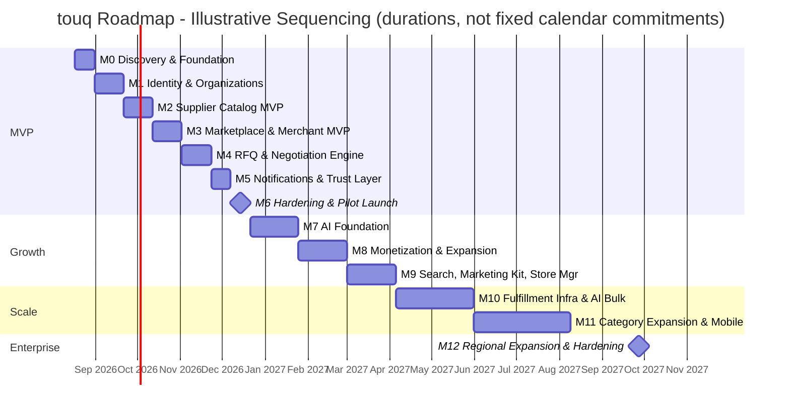

# Development Roadmap — توق (Touq)

**From MVP to Production-Ready Enterprise Platform — Agile Delivery Plan**

| | |
|---|---|
| Version | 1.0 (Draft) |
| Date | 2026-08-08 |
| Companion docs | `docs/PRD-touq.md`, `docs/ARCHITECTURE-touq.md`, `docs/UIUX-touq.md`, `docs/AI-SYSTEM-touq.md` |
| Scope | Delivery planning only — no code |

---

## 0. How to Read This Roadmap

This roadmap breaks delivery into **13 milestones (M0–M12)**, each a self-contained Agile epic spanning multiple 2-week sprints. Milestones are sequenced so the platform is always in a working, demoable state — every milestone ends with something a real supplier or merchant could use, not an internal-only artifact. Milestones M0–M6 deliver the MVP defined in `PRD-touq.md` §10; M7–M12 execute the Post-MVP Roadmap from `PRD-touq.md` §11, translated into execution-grade detail.

**Priority scale used throughout:**

| Tag | Meaning |
|---|---|
| **P0 — Critical** | Launch-blocking; nothing downstream works without it |
| **P1 — High** | Required for the platform to be competitively viable at that stage |
| **P2 — Medium** | Materially strengthens the product but a short delay is survivable |
| **P3 — Low** | Opportunistic; pulled forward only if capacity allows |

**Estimates** assume a small, senior, cross-functional squad (see §1.2) working 2-week sprints, and are sequenced with realistic overlap between adjacent milestones once API contracts are frozen — not fully parallelized, not fully sequential. Treat every estimate as planning input, not a committed date; the standard CTO discipline of re-forecasting at the start of each milestone based on actuals from the last one applies throughout.

---

## 1. Agile Operating Model

### 1.1 Cadence & Ceremonies

- **Sprint length**: 2 weeks, fixed, no exceptions — protects predictability while the team and product are both still finding their shape.
- **Ceremonies**: sprint planning (start), daily standup (async-friendly given a lean team), mid-sprint backlog grooming, sprint review/demo (every milestone's working software is demoed to the whole company, not just engineering), retrospective (end).
- **Release model**: continuous deployment to staging on every merge; production releases are milestone-gated behind a release checklist (see §1.4) rather than every sprint, until the platform reaches M9+ where feature-flag-gated continuous production deployment becomes standard.
- **Backlog structure**: each milestone in this document is an **Epic**; epics decompose into stories during sprint planning at the start of that milestone, not upfront — the tasks listed per milestone here are the epic-level breakdown a CTO plans against, not a full sprint backlog.

### 1.2 Team Scaling Plan

| Phase | Milestones | Core team size | Roles added this phase |
|---|---|---|---|
| **Founding squad** | M0–M6 (MVP) | 8–9 | Tech Lead/CTO, 2 Backend Engineers, 2 Frontend Engineers, 1 Product Designer, 1 QA Engineer, 1 part-time DevOps, Product Manager, Supplier Success/BD lead (non-eng, critical-path for pilot onboarding) |
| **Growth squad** | M7–M9 | 13–15 | +1–2 AI/ML Engineers, +1 Backend/+1 Frontend Engineer, Dedicated DevOps/SRE, Data Analyst, Supplier Success expands to a small team |
| **Scale squad** | M10–M11 | 20–24 | +2 Mobile Engineers, +1 Search/Data Engineer, +1 Integrations Engineer (Zid/Salla/shipping/payments), +1 Security Engineer, QA team expands, Engineering Manager to split squads by domain |
| **Enterprise squad** | M12 | 28–32 | SRE team (2–3), Security/Compliance Lead (PDPL, audit readiness), Regional Engineering support (GCC), dedicated MLOps Engineer, second Engineering Manager |

### 1.3 Definition of Done

A story is not "done" until: code is peer-reviewed and merged; automated tests cover the change and pass in CI; it is deployed and verified on staging; it meets the RTL/Arabic-first and accessibility bar from `UIUX-touq.md`; any flow touching auth, payments, or verification has an explicit security check-off; and product/design has signed off against the relevant spec in `UIUX-touq.md`.

### 1.4 Production Release Checklist (gates every milestone's production release)

Security review of new attack surface → data migration dry-run → load/performance smoke test on the critical path added → monitoring/alerting in place for new services (per `ARCHITECTURE-touq.md` §17) → rollback plan documented → stakeholder demo sign-off.

---

## 2. Roadmap Timeline

**Reading this chart**: bars are shown sequentially for legibility; in execution, each milestone's frontend/design work typically starts 1–2 weeks into the prior milestone once its API contracts are frozen (noted explicitly in each milestone's Dependencies). MVP (M0–M6) targets roughly **18 weeks (~4.5 months)** from kickoff. The full path to an enterprise-ready, multi-region platform (through M12) totals roughly **20–22 months** — in line with the ambition set in `PRD-touq.md` §1.4, with realistic execution buffer built in rather than the PRD's directional phase timing.

---

## 3. MVP Milestones (M0–M6)

### M0 — Discovery & Foundation

**Estimated time**: 2 weeks (Sprint 0) · **Priority**: P0 — Critical

**Objectives**
- Stand up the engineering foundation so every subsequent milestone starts on solid ground, not on scaffolding built under deadline pressure.
- Finalize the technical decisions `ARCHITECTURE-touq.md` leaves as "chosen at build time" (specific cloud provider/region, CI/CD tooling, hosting for KSA data residency).
- Begin supplier pilot curation in parallel — this has the longest lead time of anything in the MVP and must start now, not at M6.

**Tasks**

| Task | Owner | Est. |
|---|---|---|
| Cloud environment setup (network, managed Postgres, Redis, object storage, secrets manager) per `ARCHITECTURE-touq.md` §1 | DevOps/Tech Lead | 4d |
| CI/CD pipeline (build, test, deploy to staging) | DevOps | 3d |
| Monorepo scaffolding per folder architecture (`ARCHITECTURE-touq.md` §6) — apps/services/packages/infra shells, no business logic yet | Backend + Frontend leads | 3d |
| Design system foundation implementation (tokens, type scale, RTL mirroring baseline, core component shells) per `UIUX-touq.md` Part A | Product Designer + Frontend | 5d |
| Legal/compliance groundwork: PDPL data-handling policy draft, CR/Maroof verification process design (manual v1) | Product Manager + Tech Lead | 3d |
| Begin concierge sourcing of first pilot supplier cohort (Riyadh) — outreach only, not onboarding yet | Supplier Success lead | ongoing from this point |

**Dependencies**: none — this is the starting point.

**Deliverables**: working CI/CD to staging; provisioned cloud infrastructure; monorepo skeleton matching `ARCHITECTURE-touq.md` §6; implemented design tokens/RTL base; a documented PDPL data-handling policy; a warm pipeline of ~15–20 candidate pilot suppliers for M6.

**Risks**

| Risk | Mitigation |
|---|---|
| Cloud/data-residency decision delays everything downstream | Timebox the decision to this milestone only; default to the best available KSA-region option if research drags |
| Supplier outreach lead time underestimated (this is a sales/BD problem, not an engineering one) | Start it in parallel from day one, not after the product exists — it is the single longest lead-time item in the MVP |

---

### M1 — Identity & Organizations Foundation

**Estimated time**: 3 weeks · **Priority**: P0 — Critical

**Objectives**
- Ship the Identity Service and organization data model everything else depends on (`ARCHITECTURE-touq.md` §2.2).
- Implement the phone-first OTP registration/login flow exactly as specified in `UIUX-touq.md` §C.12.
- Stand up RBAC (§4–5 of the architecture doc) even though only Owner roles are exercised in MVP — this avoids a breaking data model change later.

**Tasks**

| Task | Owner | Est. |
|---|---|---|
| `users`, `organizations`, `organization_members`, `roles`/`permissions` schema + migrations | Backend | 4d |
| OTP registration/login flow (SMS provider integration, JWT + refresh token issuance) | Backend | 5d |
| Role Choice → Register → OTP → Business Details screens | Frontend + Design | 6d |
| Admin login (separate, mandatory MFA) | Backend + Frontend | 2d |
| API Gateway auth verification + permission pre-check middleware | Backend | 3d |
| Verification document upload (CR/Maroof) + `verification_documents` table | Backend + Frontend | 3d |

**Dependencies**: M0 infrastructure and design tokens must exist first. SMS/WhatsApp OTP provider contract must be selected before this milestone starts (flagged as a pre-M1 procurement task, not engineering work).

**Deliverables**: a supplier or merchant can register, verify by OTP, submit business details/documents, and log in; Admin can log in separately with MFA; RBAC enforced end-to-end on every authenticated API call.

**Risks**

| Risk | Mitigation |
|---|---|
| SMS/WhatsApp OTP delivery reliability in KSA (provider-dependent) | Select a provider with proven Saudi carrier delivery rates during M0 procurement; add a fallback provider hook in the adapter interface from day one |
| Combining supplier/merchant profiles into one `organizations` table (per architecture doc) creates unexpected coupling | Cover with tests early; the `type` discriminator and role model were already designed for this in `ARCHITECTURE-touq.md` §2.2 |

---

### M2 — Supplier Catalog MVP

**Estimated time**: 3 weeks · **Priority**: P0 — Critical

**Objectives**
- Let a verified supplier build and publish a real product catalog — this is the supply-side density the whole marketplace depends on.
- Implement the abaya-specific taxonomy/attribute model, not a generic apparel schema.

**Tasks**

| Task | Owner | Est. |
|---|---|---|
| `categories`, `attribute_definitions`, `products`, `product_variants`, `pricing_tiers`, `product_media` schema | Backend | 4d |
| Product create/edit forms with variant + tiered-pricing builder | Frontend | 6d |
| Media upload to object storage + CDN delivery | Backend | 3d |
| Product lifecycle state machine (Draft → Pending Review → Live → Paused → Archived) | Backend | 3d |
| Supplier Dashboard shell + catalog snapshot widget (`UIUX-touq.md` §C.5) | Frontend | 4d |
| Admin listings-moderation queue (approve/reject with reason) | Backend + Frontend | 3d |

**Dependencies**: M1 (org/auth must exist to scope products to a supplier org).

**Deliverables**: a verified supplier can create a multi-variant, tiered-priced product, submit it for review, and see it go live after Admin approval; Admin has a working moderation queue.

**Risks**

| Risk | Mitigation |
|---|---|
| Attribute taxonomy (fabric/cut/sleeve/etc.) turns out incomplete once real suppliers use it | Ship with the taxonomy from `ARCHITECTURE-touq.md` §2.3 as a starting point, not a fixed spec; make attribute definitions data-driven (already designed that way) so gaps are a data fix, not a migration |
| Supplier photo quality is poor without AI Image Studio (not built until M7) | Accept this as a known MVP gap; the pilot cohort is small and concierge-supported, so manual photo guidance from the Supplier Success team substitutes until M7 |

---

### M3 — Marketplace & Merchant Experience MVP

**Estimated time**: 3 weeks (overlaps M2's final week once the product API contract is frozen) · **Priority**: P0 — Critical

**Objectives**
- Give merchants a working discovery experience: browse, filter, view product detail.
- Ship database-query-backed search/filtering for MVP scale — the dedicated Search Service (`ARCHITECTURE-touq.md` §13) is deliberately deferred to M9, since MVP catalog volume doesn't yet need it.

**Tasks**

| Task | Owner | Est. |
|---|---|---|
| Merchant registration/light verification flow | Backend + Frontend | 2d |
| Marketplace browse/filter UI (`UIUX-touq.md` §C.2) backed by direct DB queries | Frontend + Backend | 6d |
| Product Details page with variant selector and tiered-pricing display (`UIUX-touq.md` §C.7) | Frontend | 4d |
| Supplier Profile public storefront (`UIUX-touq.md` §C.3) | Frontend + Backend | 4d |
| Favorites (`favorites` table + UI, `UIUX-touq.md` §C.10) | Backend + Frontend | 2d |
| Merchant Dashboard shell (`UIUX-touq.md` §C.4) | Frontend | 3d |

**Dependencies**: M2 (needs live product data to browse).

**Deliverables**: a merchant can register, browse and filter the live catalog, view a product/supplier profile in full, and save favorites.

**Risks**

| Risk | Mitigation |
|---|---|
| DB-query filtering becomes slow as catalog grows even within MVP pilot scope | Add targeted indexes on the most-filtered attribute columns; this is explicitly a stopgap bridged by M9's dedicated search, not a long-term architecture |

---

### M4 — RFQ & Negotiation Engine MVP

**Estimated time**: 3 weeks · **Priority**: P0 — Critical

**Objectives**
- Ship the platform's core transaction loop: RFQ → quote → negotiation → order — the mechanism that replaces WhatsApp sourcing, per `PRD-touq.md` §7.

**Tasks**

| Task | Owner | Est. |
|---|---|---|
| `rfqs`, `rfq_messages`, `quotes`, `orders`, `order_items`, `order_status_history` schema | Backend | 4d |
| RFQ Builder (product-scoped and general) per `UIUX-touq.md` §C.7/§C.3 | Frontend | 4d |
| In-app negotiation messaging thread | Backend + Frontend | 4d |
| Quote accept/decline/counter flow → order creation | Backend | 4d |
| Orders/Requests screen — both role views, status timeline component (`UIUX-touq.md` §C.9) | Frontend | 5d |
| RFQ/order status-change events published to the event bus (outbox pattern, `ARCHITECTURE-touq.md` §7.2) | Backend | 2d |

**Dependencies**: M2 (products to request against), M3 (merchant discovery flow feeding into RFQ creation).

**Deliverables**: a merchant can send a purchase request against a real product, a supplier can quote/negotiate/accept, and an order is created and tracked through manual status updates (Confirmed → In Production → Shipped → Delivered → Completed), matching the MVP-scoped lifecycle from `ARCHITECTURE-touq.md` §11.

**Risks**

| Risk | Mitigation |
|---|---|
| No escrow/payment integration yet means real counterparty payment risk between merchant and supplier (flagged explicitly in `PRD-touq.md` §8) | Make this limitation transparent in-product (e.g., a persistent note on the order screen); this is an accepted, deliberate MVP trade-off, not an oversight — escrow lands in M8 |
| Negotiation UX proves too slow/clunky for real usage patterns | Pilot with the concierge-onboarded supplier cohort first (M6) and iterate before wider rollout |

---

### M5 — Notifications & Trust Layer MVP

**Estimated time**: 2 weeks · **Priority**: P0 — Critical

**Objectives**
- Ship the multi-channel Notification Service (`ARCHITECTURE-touq.md` §12) — critical given the target users live in WhatsApp/SMS, not email.
- Add the review/rating loop that closes the trust cycle described in `ARCHITECTURE-touq.md` §7.

**Tasks**

| Task | Owner | Est. |
|---|---|---|
| Notification Service: event subscription, template registry (AR/EN), delivery logging | Backend | 5d |
| SMS + WhatsApp channel adapters | Backend | 3d |
| Email channel adapter | Backend | 1d |
| In-app notification center + bell dropdown (`UIUX-touq.md` §C.11) | Frontend | 3d |
| Notification preferences UI (`UIUX-touq.md` §C.13) | Frontend + Backend | 2d |
| Reviews/ratings on completed orders (`reviews` table + UI) | Backend + Frontend | 3d |

**Dependencies**: M4 (order/RFQ events must exist to notify on); M1 (OTP provider contract already in place, same provider reused for transactional notifications).

**Deliverables**: every RFQ/order status change reliably notifies the relevant party across their preferred channel; merchants can rate suppliers after a completed order, visible on the Supplier Profile.

**Risks**

| Risk | Mitigation |
|---|---|
| WhatsApp Business Platform approval/setup takes longer than engineering expects (external dependency, provider-side review) | Start the WhatsApp Business API application process in M0/M1, not M5 — flagged here as a cross-milestone dependency to track explicitly |

---

### M6 — MVP Hardening & Pilot Launch

**Estimated time**: 2 weeks · **Priority**: P0 — Critical

**Objectives**
- Take the MVP from "feature complete" to "safe to put in front of real suppliers and merchants."
- Launch the concierge-curated Riyadh pilot per `PRD-touq.md` §10.

**Tasks**

| Task | Owner | Est. |
|---|---|---|
| Security review (auth flows, RBAC boundary tests, rate limiting on registration/OTP/RFQ endpoints per `ARCHITECTURE-touq.md` §16) | Tech Lead + QA | 4d |
| End-to-end QA pass across every screen in `UIUX-touq.md`, both locales, all breakpoints | QA | 5d |
| Performance/load smoke test on the RFQ/order critical path | DevOps + Backend | 2d |
| Analytics instrumentation for MVP success metrics (`PRD-touq.md` §10.3) | Backend + PM | 2d |
| Onboard curated pilot supplier cohort (concierge, hands-on) | Supplier Success | 5d, ongoing |
| Production release per the checklist in §1.4 | Whole team | 1d |

**Dependencies**: M1–M5 all complete.

**Deliverables**: **MVP is live.** A curated set of ~50–100 verified Riyadh suppliers with real catalogs, open merchant access nationally, and instrumented metrics feeding the success criteria defined in the PRD.

**Risks**

| Risk | Mitigation |
|---|---|
| Cold-start risk (`PRD-touq.md` §8) — merchants find a thin catalog if supplier onboarding lags | Concierge onboarding started in M0 specifically to avoid this; do not open merchant marketing/acquisition until the curated supplier cohort is genuinely live |
| Real-world usage surfaces UX gaps invisible in internal QA | Plan the first 2–4 weeks post-launch as an explicit rapid-iteration period, not the start of M7 — hold M7 scope loosely until pilot feedback is in |

---

## 4. Growth Milestones (M7–M9)

### M7 — AI Foundation: Product Creator & Image Studio v1

**Estimated time**: 5 weeks · **Priority**: P1 — High

**Objectives**
- Ship the first AI capabilities defined in `AI-SYSTEM-touq.md` — the platform's core competitive differentiator — starting with the two modules that most directly reduce supplier onboarding friction.
- Stand up the shared Vision Recognition Engine and Generative Image Engine (`AI-SYSTEM-touq.md` §2), since every later AI module depends on them.

**Tasks**

| Task | Owner | Est. |
|---|---|---|
| Vision Recognition Engine integration (hosted vision-language model, attribute extraction with confidence scoring) | AI/ML Engineer + Backend | 8d |
| AI Product Creator flow: upload → draft product → confidence-gated review UI (`AI-SYSTEM-touq.md` §3.1, §3.6) | AI/ML + Frontend | 8d |
| Generative Image Engine: background removal + quality enhancement (segmentation + denoise/upscale models) | AI/ML Engineer | 7d |
| Luxury background packs + social-size batch export (`AI-SYSTEM-touq.md` §3.2) | AI/ML + Design | 6d |
| Model Registry & Feedback Store (captures supplier corrections per `AI-SYSTEM-touq.md` §6) | Backend | 4d |
| AI usage allowance metering (ties into plan tiers, `AI-SYSTEM-touq.md` §8) | Backend | 3d |

**Dependencies**: M2 (products/media pipeline must exist), M6 (needs live pilot suppliers to validate against real, messy photo input — this is intentionally sequenced after MVP launch, not before).

**Deliverables**: suppliers can create a draft product from photos in under a minute and run background removal/enhancement/luxury backgrounds on their images, with every AI output routed through the confidence-gated human-review pattern from `AI-SYSTEM-touq.md` §5.

**Risks**

| Risk | Mitigation |
|---|---|
| Hosted vision model accuracy on real Saudi-supplier photos (messy backgrounds, poor lighting) is lower than expected | Ship confidence-gated UX from day one, not after a quality problem surfaces (already designed this way); budget the first sprint here as calibration against real pilot photos, not assumed-correct integration |
| AI inference cost per product creation exceeds plan | Meter usage from the start (task above) even before hard billing enforcement, so real cost-per-supplier data exists before M8 monetization work |

---

### M8 — Monetization Foundations & Geographic Expansion

**Estimated time**: 5 weeks (overlaps M7) · **Priority**: P1 — High

**Objectives**
- Turn on the platform's first real revenue per `PRD-touq.md` §2.4.
- Expand supplier sourcing beyond Riyadh, per `PRD-touq.md` §11 Phase 2.
- Pilot a lightweight in-platform payment/escrow flow with a trusted supplier subset, directly addressing the payment-trust risk flagged since M4.

**Tasks**

| Task | Owner | Est. |
|---|---|---|
| `plans`, `subscriptions` schema + merchant subscription tiers (Free/Pro) with RFQ-limit enforcement | Backend | 4d |
| `featured_placements` schema + supplier self-serve purchase flow | Backend + Frontend | 4d |
| Billing & Plan settings screens (`UIUX-touq.md` §C.13) | Frontend | 3d |
| Payment Service v1: single gateway adapter (mada-enabled provider), hosted checkout/tokenization only (`ARCHITECTURE-touq.md` §14) | Backend | 8d |
| Escrow release logic (hold on `order.confirmed`, release on `order.completed`) piloted with a subset of verified suppliers | Backend | 5d |
| Expand concierge supplier onboarding to Jeddah, Mecca, Al-Ahsa | Supplier Success | ongoing |

**Dependencies**: M6 (live MVP), M7 (AI usage metering informs plan design economics).

**Deliverables**: merchant Free/Pro tiers live; suppliers can purchase featured placement; a working, PCI-scope-minimized escrow pilot running with a defined subset of orders; supplier base expanded to 3–4 cities.

**Risks**

| Risk | Mitigation |
|---|---|
| Introducing fees too early accelerates disintermediation to WhatsApp (`PRD-touq.md` §8, the platform's single biggest existential risk) | Monetize visibility (subscriptions, featured placement) before the transaction itself, exactly as sequenced in `PRD-touq.md` §2.4; escrow pilot is opt-in and framed as an added-value convenience, not a fee mandate |
| Payment gateway PCI/regulatory review takes longer than engineering expects | Start gateway vendor/compliance conversations at the start of M7, not M8 |

---

### M9 — Dedicated Search, Marketing Kit & Store Manager v1

**Estimated time**: 5 weeks · **Priority**: P1 — High

**Objectives**
- Replace MVP's DB-query filtering with the dedicated Search Service from `ARCHITECTURE-touq.md` §13, needed now that catalog volume has grown across 4 cities.
- Ship AI Marketing Kit and the first version of the AI Store Manager (`AI-SYSTEM-touq.md` §3.3, §3.7).

**Tasks**

| Task | Owner | Est. |
|---|---|---|
| Search index + event-driven indexing pipeline (`product.published`/`updated`/`unpublished` consumers) | Backend | 6d |
| Bilingual (AR/EN) relevance tuning, faceted filters, ranking with rating/response-time/featured boosts | Backend + AI/ML | 6d |
| Marketplace/Search UI migrated to the new Search API (`UIUX-touq.md` §C.2, §C.8) | Frontend | 4d |
| Generative Text Engine integration: captions, SEO metadata, hashtags, marketing copy | AI/ML | 6d |
| Conversational Orchestrator v1 (Store Manager): intent routing to Create/Improve Photos/Translate skills, chat UI, voice input | AI/ML + Frontend | 10d |

**Dependencies**: M7 (Generative Text/Image engines reused by Store Manager and Marketing Kit), M8 (expanded catalog volume is the reason Search is needed now).

**Deliverables**: fast, faceted, bilingual search and filtering at scale; suppliers can generate marketing assets in one click; the Store Manager chat assistant is live for its first three skills.

**Risks**

| Risk | Mitigation |
|---|---|
| Search index and primary DB drift under load | Index is explicitly rebuildable from source of truth per `ARCHITECTURE-touq.md` §13; add a scheduled full-reindex job as a safety net from day one |
| Store Manager's natural-language routing misfires on ambiguous Arabic dialect input | Constrain its action surface to a fixed skill allow-list (already the architecture, `AI-SYSTEM-touq.md` §3.7) and default to a clarifying question over a wrong guess |

---

## 5. Scale Milestones (M10–M11)

### M10 — Fulfillment Infrastructure & AI Catalog Scanner/Bulk Import

**Estimated time**: 8 weeks · **Priority**: P1 — High

**Objectives**
- Integrate real shipping/logistics per `ARCHITECTURE-touq.md` §14, closing the "manual status update" gap from M4.
- Ship supplier analytics and Verified/Pro badges to deepen the trust layer.
- Ship the two AI modules that most accelerate large-supplier onboarding: Catalog Scanner and Bulk Import (`AI-SYSTEM-touq.md` §3.4–§3.5).

**Tasks**

| Task | Owner | Est. |
|---|---|---|
| Shipping Service with unified carrier adapter interface (rate, create shipment, track) + first carrier integration | Backend + Integrations Engineer | 10d |
| Carrier tracking webhooks → `order.status_changed` | Backend | 3d |
| Verified/Pro supplier badge tier + response-time-guarantee mechanics | Backend + Frontend | 4d |
| Supplier analytics dashboard (views, RFQ conversion, pricing benchmarks) | Backend + Frontend + Data Analyst | 6d |
| Document/OCR Ingestion Engine (PDF + WhatsApp-image batch parsing, product segmentation) | AI/ML | 8d |
| AI Bulk Import: clustering, async batch pipeline, live-progress review UI (`AI-SYSTEM-touq.md` §3.5) | AI/ML + Backend + Frontend | 10d |
| AI Catalog Scanner UI reusing the Bulk Draft Review experience | Frontend | 3d |
| Dispute-resolution tooling in Admin (`UIUX-touq.md` §C.6) | Backend + Frontend | 4d |

**Dependencies**: M8 (payment/escrow context needed for dispute resolution), M9 (Vision Recognition Engine reused by Catalog Scanner/Bulk Import).

**Deliverables**: real carrier-tracked shipping; a mature trust layer (verified badges, analytics, disputes); suppliers can import hundreds of existing products from a PDF catalog or WhatsApp photo dump in one sitting.

**Risks**

| Risk | Mitigation |
|---|---|
| Carrier API reliability/coverage varies across KSA regions | Design the adapter interface (already specified) to support multiple carriers from the start; don't hard-couple the platform to one provider |
| Bulk import GPU/inference load spikes unpredictably (large factory onboarding a full catalog at once) | Async job infrastructure scales independently of the API tier by design (`ARCHITECTURE-touq.md` §7.4); load-test specifically against a "500 images at once" scenario before general release |

---

### M11 — Category Expansion, Mobile Apps & Financing

**Estimated time**: 10 weeks · **Priority**: P2 — Medium

**Objectives**
- Expand beyond the single-category wedge, per `PRD-touq.md` §6 and §11 Phase 4 — deliberately only now, once trust and supply-side density are proven in the abaya category.
- Ship native mobile apps.
- Introduce trade financing partnerships and the remaining maturity-dependent AI modules.

**Tasks**

| Task | Owner | Est. |
|---|---|---|
| Category/taxonomy extension for hijabs, thobes, kids' abayas, accessories (data-driven, reuses `attribute_definitions`) | Backend + Content/Category Manager | 6d |
| Category-specific Vision Recognition tuning for new product types | AI/ML | 8d |
| Native mobile apps (iOS/Android), core flows: browse, RFQ, orders, notifications | Mobile Engineers | 30d |
| Trade financing/BNPL partner integration (revenue-share origination) | Backend + Integrations Engineer | 8d |
| AI RFQ Quote Assistant (`AI-SYSTEM-touq.md` §4.3) | AI/ML + Backend | 6d |
| AI Trend & Demand Insights (`AI-SYSTEM-touq.md` §4.4) | AI/ML + Data Analyst | 8d |
| Bulk RFQ broadcast (one request to multiple matching suppliers) | Backend + Frontend | 5d |

**Dependencies**: M10 (mature fulfillment/trust layer expected before expanding scope), M9 (Search taxonomy must already be data-driven — it is, by design).

**Deliverables**: multi-category catalog live; native apps in both stores; a financing option available to qualifying merchants; suppliers get AI-drafted RFQ replies and trend insights.

**Risks**

| Risk | Mitigation |
|---|---|
| Category expansion dilutes the abaya-specific trust/taxonomy advantage that differentiates touq from horizontal competitors (`PRD-touq.md` §12 recommendation #8) | Expand only into directly adjacent modest-fashion categories, keep abaya-specific taxonomy depth as the flagship experience, and gate expansion behind this milestone rather than pulling it earlier |
| Mobile app scope creep (native apps are a large, easy-to-underestimate effort) | Ship core flows only in v1 (explicitly scoped in the task above); defer AI-heavy flows (Bulk Import, Store Manager voice) to a mobile v2 |

---

## 6. Enterprise Milestone (M12)

### M12 — Regional (GCC) Expansion & Enterprise Hardening

**Estimated time**: 14 weeks · **Priority**: P2 — Medium (P0 for any specific regulatory/compliance item once a target market is chosen)

**Objectives**
- Execute `PRD-touq.md` §11 Phase 5 — expand into GCC markets using the proven Saudi playbook.
- Bring the platform to genuine enterprise-grade maturity: security/compliance rigor, multi-region infrastructure, and full observability discipline, closing every "future/deferred" item flagged across the four companion docs.

**Tasks**

| Task | Owner | Est. |
|---|---|---|
| Multi-region infrastructure (data residency per target market, latency-aware routing) | DevOps/SRE | 15d |
| Localization beyond AR/EN for target GCC markets (extends the Generative Text Engine, `AI-SYSTEM-touq.md` §11) | AI/ML + Content | 10d |
| Regional CR-equivalent verification integrations per new market | Backend + Compliance Lead | 10d |
| Formal security/compliance program: PDPL audit readiness, access-review cadence, incident-response runbooks | Security/Compliance Lead | 20d |
| SRE maturity: multi-AZ DR drills, defined RPO/RTO, on-call rotation, full observability per `ARCHITECTURE-touq.md` §17 | SRE team | 15d |
| AI maturity: Virtual Try-On, Visual Search, Pricing Intelligence, Moderation Assist at full production quality (`AI-SYSTEM-touq.md` §4.1, §4.7–§4.9) | AI/ML team | 25d |
| White-label storefront tooling + Zid/Salla integration adapters live (`ARCHITECTURE-touq.md` §14) | Integrations Engineer | 15d |

**Dependencies**: M11 (multi-category, mobile, and financing maturity expected before regional expansion multiplies operational complexity).

**Deliverables**: touq operating in at least one additional GCC market with local compliance handled; a security/compliance posture ready for enterprise merchant and financing-partner due diligence; the full AI product suite from `AI-SYSTEM-touq.md` in production; the platform is, by every dimension across all four companion documents, the production-ready enterprise system this roadmap set out to build.

**Risks**

| Risk | Mitigation |
|---|---|
| Regional regulatory requirements (verification, payments, data residency) differ enough per market to each need dedicated work | Treat each new market as its own sub-milestone with a compliance-first task, not a copy-paste of the Saudi launch |
| Organizational scaling risk — a 30-person org with multiple squads needs real engineering management, not the founding-team informality that worked through M0–M9 | Second Engineering Manager and formal squad structure introduced in this milestone's team plan (§1.2), not left implicit |
| Expansion draws focus from the core Saudi market before it's fully defended | Gate M12 kickoff on Saudi metrics (from `PRD-touq.md` §10.3-style tracking) still trending healthy — expansion should be additive, not a distraction from a market not yet won |

---

## 7. Cross-Cutting CTO Risks (Apply Across the Whole Roadmap)

| Risk | Why it matters | Mitigation |
|---|---|---|
| **Scope creep inside any single milestone** | The fastest way a startup roadmap slips is each milestone quietly absorbing "just one more thing" | Every milestone's task list here is the epic-level contract; new requests during a milestone go to the next milestone's backlog, not into the current sprint, without an explicit re-plan |
| **Hiring lag vs. team-scaling plan** | §1.2's team growth is aspirational until people are actually hired; AI/ML and Mobile roles in particular have longer sourcing lead times | Start recruiting for M7's AI/ML role and M11's Mobile roles at least one full milestone ahead of when the roadmap needs them |
| **Technical debt from MVP speed** | M0–M6 deliberately favor speed (DB-query search, manual order status, no escrow) over long-term architecture | Every deliberate MVP shortcut in this document is explicitly named as such, with the milestone that retires it identified (e.g., DB-query search → M9's dedicated Search Service) — nothing is an accidental shortcut discovered later |
| **Disintermediation risk compounding if monetization is mistimed** | The platform's single biggest existential risk per `PRD-touq.md` §8 | The monetization sequencing in M8 is deliberately conservative (visibility fees before transaction fees) — resist pressure to pull transaction-fee monetization earlier than the escrow/logistics maturity that justifies it |
| **AI cost scaling faster than AI revenue** | Generative image/video inference is the most expensive line item in the AI system | Usage metering ships in M7 alongside the first AI feature, not retrofitted after costs are already a surprise |
