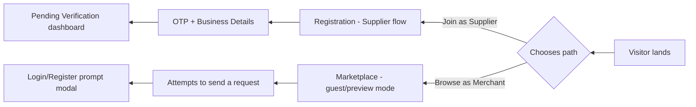
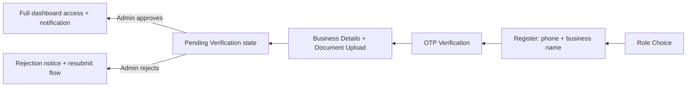

# UI/UX Design Specification — توق (Touq)

**Modern Luxury, Arabic-First, RTL-Native Design System for the B2B Abaya Marketplace**

| | |
|---|---|
| Version | 1.0 (Draft) |
| Date | 2026-08-08 |
| Companion docs | `docs/PRD-touq.md`, `docs/ARCHITECTURE-touq.md` |
| Scope | Design specification only — no code, no markup |

---

# PART A — Design Foundations

## A.1 Design Philosophy

توق borrows its visual language from premium fashion e-commerce (the register of Net-a-Porter, Ounass, Farfetch, high-end abaya houses) rather than generic B2B/SaaS utility design — because trust and perceived quality are the platform's core conversion lever in a market currently built on informal WhatsApp trading. Five principles govern every screen:

1. **Restraint over decoration.** Luxury reads through negative space, typographic confidence, and photography — not through gradients, drop shadows, or busy UI chrome. Every non-essential visual element is removed.
2. **Editorial, not e-commerce-generic.** Layouts borrow from fashion editorial grids (large imagery, deliberate asymmetry in marketing pages) while dashboards stay disciplined and data-dense where the job requires it (Admin, Orders).
3. **Arabic is the native language of the interface**, not a translated afterthought. Arabic typography, RTL layout, and Arabic content are designed first; the English/LTR experience is the mirrored, secondary variant — not the other way around.
4. **Trust is a design material.** Verification badges, ratings, response-time indicators, and status clarity are treated as first-class visual elements throughout — they are what replaces the trust a merchant currently gets from a personal WhatsApp relationship.
5. **Calm motion.** Micro-interactions are slow, soft, and purposeful (fades, gentle elevation on hover, smooth height transitions) — never bouncy, playful, or attention-grabbing. Motion confirms an action succeeded; it never decorates.

## A.2 Color System

A warm, muted, editorial palette — ivory and charcoal as the dominant neutrals, a single bronze/gold accent used sparingly as the mark of primary action and trust (echoing gold detailing common in premium abaya embroidery), with fully desaturated status colors so system feedback never feels like a generic app.

| Token | Hex (indicative) | Usage |
|---|---|---|
| `surface/ivory` | `#F8F4EE` | Default page background |
| `surface/white` | `#FFFFFF` | Cards, panels, elevated surfaces |
| `surface/charcoal-deep` | `#14120F` | Dashboard sidebars, footer, admin chrome |
| `text/primary` | `#201D1A` | Headlines, primary body text |
| `text/secondary` | `#5C564E` | Supporting text, captions, metadata |
| `text/on-dark` | `#F3EFE8` | Text on charcoal/sidebar surfaces |
| `brand/gold` | `#A9782E` | Primary buttons, active states, links, verified-badge accent |
| `brand/gold-hover` | `#8A611F` | Hover/pressed state of gold elements |
| `border/sand` | `#E6DED0` | Dividers, input borders, card outlines |
| `status/success` | `#6B8F71` | Verified, completed, in-stock |
| `status/warning` | `#C08A3E` | Pending review, expiring soon |
| `status/error` | `#B5533C` | Rejected, disputed, destructive actions |
| `status/info` | `#5A7A94` | Informational banners, "new" indicators |

Role-based tinting keeps the same palette while giving each experience a distinct "home": the public site and Merchant Dashboard use the ivory surface throughout; Supplier and Admin dashboards use a deep-charcoal sidebar against the same ivory content area, giving suppliers/ops staff a more "workspace" feel while keeping one visual system.

## A.3 Typography

| Role | Arabic typeface | Latin typeface | Notes |
|---|---|---|---|
| Display / editorial headlines | Noto Kufi Arabic (or equivalent geometric Kufi) | Marcellus (elegant high-contrast serif) | Used only on marketing surfaces (Landing, Supplier Profile hero, empty-state headlines) |
| UI headings & body | IBM Plex Sans Arabic | Inter | Used everywhere inside product UI — dashboards, forms, tables, buttons |
| Numerals | Western Arabic numerals (0–9) | Same | Chosen over Eastern Arabic-Indic numerals for consistency with prices, SKUs, and phone numbers across both locales — a single, unambiguous numeral system for commerce data |

**Type scale** (size/line-height in px):

| Style | Size/Line-height | Use |
|---|---|---|
| Display XL | 56/64 | Landing hero headline only |
| Display L | 40/48 | Section headlines on marketing pages |
| H1 | 32/40 | Page titles inside product |
| H2 | 24/32 | Section titles within a page |
| H3 | 20/28 | Card/panel titles |
| Body L | 16/26 | Primary reading text, form labels |
| Body M | 14/22 | Default UI text, table cells |
| Body S | 12/18 | Captions, timestamps, helper text |
| Overline | 11/16, letter-spaced, gold accent | Eyebrow labels above headings (English: uppercase; Arabic: no case transform — spacing + color + weight carry the same role) |

## A.4 RTL & Arabic-First Rules

- **The entire layout mirrors**, not just text alignment: navigation order, sidebar position, breadcrumb direction, form label placement, table column order, progress steppers, and drawer/modal slide-in direction all flip for Arabic (default) vs. English.
- **Icon mirroring policy**: directional icons (back/forward chevrons, arrows, "send" icon, breadcrumb separators, carousel prev/next) flip horizontally in RTL. Non-directional icons (search, bell, heart, star, user, verified checkmark, play button, upload) never flip.
- **Drawers and side panels** open from the leading edge of reading direction — the **right** edge in Arabic/RTL, the left edge in English/LTR.
- **Language toggle** (AR/EN) lives in the same global position (top bar, far end) on every page; switching triggers a full layout mirror, not just a string swap.
- **Bidi-safe fields**: mixed-direction content (Latin brand names, SKUs, phone numbers embedded in Arabic sentences) is isolated so it never visually scrambles inside RTL paragraphs.
- **Default locale is Arabic** for every new session (detected by browser/device locale, overridable by the user and persisted to their profile).

## A.5 Grid & Breakpoints

| Breakpoint | Range | Grid | Margins | Gutter |
|---|---|---|---|---|
| Mobile | <640px | 4 columns | 16px | 12px |
| Tablet | 640–1023px | 8 columns | 32px | 20px |
| Desktop | 1024–1439px | 12 columns | 64px | 24px |
| Large Desktop | ≥1440px | 12 columns, max content width 1320px, centered | auto | 24px |

Spacing scale (base unit 8px): 4, 8, 12, 16, 24, 32, 48, 64, 96 — used for all padding/margin/gap decisions across every screen.

## A.6 Core Component Library

Every screen in Part C is built from this shared set. States listed apply to every instance unless a screen calls out an exception.

| Component | Variants | States | Notes |
|---|---|---|---|
| **Button** | Primary (solid gold), Secondary (outline charcoal), Tertiary (text link), Icon button, Destructive (outline/solid terracotta) | Default, Hover (subtle elevation + darken), Active/Pressed, Focus (visible outline for keyboard/a11y), Disabled (reduced opacity, no pointer), Loading (label replaced by inline spinner, width preserved) | Only one Primary button visible per view/section — luxury restraint rule |
| **Text Input** | Single-line, Textarea, Phone (country-code prefix), Search, Price/quantity numeric | Default, Focus (gold underline/border), Filled, Error (terracotta border + inline message), Disabled | |
| **OTP Input** | 6-segment boxes | Empty, Active digit, Filled, Error (shake + terracotta), Success (auto-advance) | |
| **Select / Dropdown** | Single-select, Multi-select chips, Region/city cascading select | Default, Open, Selected, Disabled | |
| **Slider** | Price range (dual-handle), Rating filter | Default, Dragging, Disabled | |
| **Stepper** | Quantity input (−/N/+) | Default, Min-reached (− disabled at MOQ), Max-reached | |
| **Card** | Product card, Supplier card, Order/RFQ card, Notification card, Stat tile | Default, Hover (gentle lift + border darken), Selected, Skeleton/loading | |
| **Badge** | Verified (gold check), Status pill (color per state), Rating (stars + numeric), "Featured", "New" | Static | Status pill colors map to §A.2 status tokens |
| **Table** | Data table (admin, orders) | Default row, Hover row, Selected row (checkbox), Sortable header, Empty | |
| **Stepper/Timeline** | Order status tracker | Completed step, Current step (accent), Upcoming step (muted), Error/disputed step | Direction mirrors per RTL/LTR |
| **Tabs** | Underline tabs, Pill tabs | Active, Inactive, Disabled | |
| **Modal** | Standard, Confirmation (destructive) | Enter/exit fade+scale | |
| **Drawer / Side Panel** | Filters (mobile), Order detail, Notification quick view | Slide in from leading edge | |
| **Toast / Snackbar** | Success, Error, Info, Undo-action | Auto-dismiss (success/info), Persistent until action (error) | |
| **Empty State** | Illustration + headline + helper text + CTA | — | Every list/grid in the product defines one |
| **Loading State** | Skeleton blocks matching final layout | — | Used instead of spinners for content-heavy views |

---

# PART B — Global Shell & Navigation

## B.1 Public Header (Unauthenticated)

Sticky top bar, ivory background, sand-colored bottom border. In RTL reading order (right → left): logo mark, primary nav links (Marketplace, Suppliers, How It Works, Pricing), then at the far end (visually left in RTL): language toggle (AR/EN segmented control), "Login" text button, "Join as Supplier" secondary button, "Browse Marketplace" primary button. Collapses to logo + hamburger icon button below tablet breakpoint; hamburger opens a full-height drawer sliding from the right (RTL leading edge) containing the same links stacked, plus the language toggle and both CTAs full-width at the bottom.

## B.2 Public Footer

Four-to-five column layout (For Merchants, For Suppliers, Company, Legal & Trust, Contact/Social), a bottom strip with language/region selector, PDPL/privacy links, and trust marks (verified-business iconography, security note). Collapses to stacked accordion sections on mobile.

## B.3 Authenticated App Shell (Merchant / Supplier / Admin)

A persistent two-zone shell: a **sidebar** (role-specific nav items, collapsible to icon-only on desktop, becomes a bottom tab bar or slide-in drawer on mobile) and a **top bar** (contextual page title/breadcrumb, global search where applicable, notification bell with unread badge, profile/org menu). Sidebar sits on the trailing edge of reading direction — right side in Arabic/RTL — with content flowing to its left.

- **Merchant sidebar items**: Dashboard, Marketplace, My Requests (RFQs), Orders, Favorites, Messages, Notifications, Settings.
- **Supplier sidebar items**: Dashboard, My Products, RFQ Inbox, Orders, Reviews, Insights, Messages, Settings.
- **Admin sidebar items**: Overview, Verification Queue, Listings Moderation, Users & Organizations, Orders & Disputes, Plans & Placements, Taxonomy, Reports, System Settings.

**Mobile navigation**: Merchant and Supplier apps use a 5-item bottom tab bar (Home, Marketplace/Catalog, Requests, Favorites/Reviews, Profile) mirrored RTL (first tab renders at the right); Admin has no mobile-optimized shell in V1 (desktop-only tool), consistent with it being an internal ops surface.

Profile/org menu (top-right of the top bar, i.e., far end from the sidebar) contains: Account Settings, Organization Settings, Switch Organization (Enterprise multi-org, future), Language toggle, Help/Support, Logout.

---

# PART C — Screen-by-Screen Specification

## C.1 Landing Page

**Purpose**: Convert first-time visitors into registered suppliers (priority, since supply density is the bootstrap constraint) or merchants, while establishing premium trust on first impression.

**Layout (top → bottom):**

1. **Header** — see B.1.
2. **Hero** — full-bleed editorial photography of abayas/fabric detail; large Display-XL Arabic Kufi headline (e.g., "مصدر الجملة الموثوق للعباءات"); supporting Body-L subheadline; two CTAs side by side — Primary **"انضم كمورد" (Join as Supplier)**, Secondary **"تصفح كتاجر" (Browse as Merchant)**; a thin trust-indicator row beneath (e.g., verified-supplier count, product count, cities covered) in Overline style.
3. **Value proposition** — three-column block: "For Merchants" / "For Suppliers" / "Why Touq", each with a line icon, H3 title, Body-M description.
4. **Featured Categories/Styles** — horizontally scrollable tile row (Classic, Open Abaya, Kimono, Butterfly, Embroidered…), each tile = image + label, clicking filters directly into Marketplace.
5. **Featured/Verified Suppliers carousel** — Supplier Cards (logo, name, verified badge, rating, city), each with a "View Profile" tertiary button; carousel prev/next icon buttons (mirrored direction in RTL).
6. **How It Works** — numbered horizontal timeline (Register → Get Verified → List/Browse → Send or Receive Request → Negotiate → Fulfill Order), flowing right-to-left in Arabic.
7. **Testimonials** — quote cards from early suppliers/merchants.
8. **Stats band** — large numerals (suppliers, merchants, cities, requests facilitated), 4-column desktop / 2×2 mobile.
9. **CTA banner** — closing full-width band, headline + the same dual Join/Browse buttons.
10. **Footer** — see B.2.

**Buttons on this page**: Login (text), Join as Supplier (primary, repeated in header/hero/CTA banner), Browse as Merchant (secondary, header + hero), language toggle, category tiles (image buttons), "View Profile" per supplier card, carousel prev/next, footer links.

**Key workflow**:

**Responsive**: hero CTAs stack full-width on mobile; carousels become single-card swipe; stats band becomes 2×2 grid; "How It Works" timeline becomes a vertical stepper.

**States**: no empty/error states (static marketing content); a slow-connection skeleton is used for the featured-suppliers carousel only, since it's dynamic.

---

## C.2 Marketplace (Browse/Catalog)

**Purpose**: primary discovery surface for merchants and guests to find abaya products across all suppliers.

**Layout**:

- **Search bar**, sticky at top, full-width, with placeholder text rotating through example queries.
- **Toolbar** below search: result count (e.g., "1,204 نتيجة"), Sort dropdown (Most relevant / Newest / Price ↑↓ / Highest rated / Fastest response), grid/list view toggle, active-filter chip row (each chip has an "×" remove).
- **Filter panel** on the trailing edge (right in RTL) — persistent sidebar on desktop, opens as a bottom-sliding drawer on mobile via a "Filters" button: Style/Category checkboxes, Fabric type, Color swatches, Price range (dual-handle slider, SAR), MOQ range, Region/City, Supplier rating (star filter), "Verified suppliers only" toggle, Availability (In stock / Made-to-order), **"Clear All"** and **"Apply"** buttons at the panel's base.
- **Product grid**: 4 columns desktop / 3 tablet / 2 mobile. Each **Product Card**: primary image (hover swaps to secondary image on desktop), Favorite heart icon (top corner, toggles filled/outline), "Featured" tag if sponsored, title (2-line clamp), supplier name + verified badge + mini star rating, price shown as "من [price] ر.س" (tiered pricing "from" price), MOQ caption, "Quick View" button appearing on hover (desktop only).
- **Pagination**: "Load More" button at grid end (cursor-based), or infinite scroll with a loading skeleton row.

**Buttons**: Filters toggle (mobile), Apply/Clear filters, Sort dropdown, grid/list toggle, per-card Favorite heart, per-card Quick View, filter chip removers, Load More.

**Workflow**: browse/filter → click card → Product Details (C.7); or click heart → if unauthenticated, a login-prompt modal appears instead of saving.

**Empty state**: illustration + "لا توجد منتجات تطابق الفلاتر المحددة" + "Clear Filters" button.
**Loading state**: skeleton product cards matching final grid layout.

---

## C.3 Supplier Profile (Public Storefront)

**Purpose**: build merchant trust in one specific supplier and surface their full catalog; the primary place a general (non-product-specific) purchase request originates.

**Layout**:

- **Cover banner** (supplier's uploaded cover image) with a subtle gradient overlay for legibility.
- **Profile header card** overlapping the banner: logo, business name (AR primary/EN secondary), **Verified badge** (prominent, gold check + "موثّق" label), city/region, years active, average response time, star rating + review count, and action buttons: **"إرسال طلب شراء" (Send Purchase Request)** primary, **"متابعة" (Follow/Save)** secondary icon+label toggle, **"مراسلة" (Message)** tertiary.
- **Stat row**: Total Products, Completed Orders, Avg Response Time, Member Since — four stat tiles.
- **Tabs**: Products | About | Reviews | Policies.
  - *Products*: this supplier's catalog reusing the Product Card grid, with an in-tab mini filter (style/fabric only).
  - *About*: bilingual description, business type (workshop/factory/trader), verification summary (CR number masked to last 4 digits, Maroof badge), city-level address (no exact address, for privacy/safety).
  - *Reviews*: rating distribution bar (5★→1★), list of review cards (rating, comment, order context, merchant name initials, date); **"Write a Review"** button visible only to merchants with a completed order from this supplier.
  - *Policies*: general MOQ/lead-time/return policy text the supplier maintains.
- **Sticky mobile CTA bar**: "Send Purchase Request" pinned to bottom of viewport while scrolling.

**Buttons**: Send Purchase Request (primary), Follow/Save (icon+label toggle), Message, Share (icon), Report (overflow menu, trust & safety), tab switches, Write a Review (conditional), pagination within Products tab.

**Workflow**: merchant arrives from Marketplace/Search → reviews trust signals (badge, rating, response time) → either opens a specific product then sends a scoped request, or sends a general request from the header CTA, which opens the **RFQ Builder** (see C.9) without a pre-selected product, prompting the merchant to describe their need.

---

## C.4 Merchant Dashboard

**Purpose**: merchant's home base after login — status at a glance, fast paths into core actions.

**Layout** (inside the authenticated shell, B.3):

- **Welcome header**: "مرحباً بعودتك، [الاسم]" + current date/plan tier badge.
- **Stat tile row**: Active Requests, Pending Quotes (highlighted if action needed), Active Orders, Saved Suppliers.
- **Plan usage widget**: for Free tier, a progress bar "استخدمت 3 من 5 طلبات هذا الشهر" with an **"الترقية إلى Pro" (Upgrade to Pro)** button; hidden/replaced by a simple plan badge for Pro/Enterprise.
- **Quick actions row**: three large tappable cards — "تصفح السوق" (Browse Marketplace), "طلب شراء جديد" (New Purchase Request), "المفضلة" (Favorites).
- **Continue where you left off**: horizontal list of the 2–3 most recent RFQ/Order cards with status pill and a contextual primary action ("View Quote", "Confirm Delivery"…).
- **Recommended for you**: carousel of suggested products/suppliers (based on browse/favorite history).
- **Activity preview panel**: last 3–5 notifications with a "View All" link into C.11.

**Buttons**: Upgrade to Pro, each quick-action card, per-recent-item contextual action button, "View All" (notifications), carousel navigation.

---

## C.5 Supplier Dashboard

**Purpose**: supplier's home base — verification status, RFQ responsiveness, and catalog health are the primary signals surfaced, since response time and completeness directly drive their marketplace ranking.

**Layout**:

- **Welcome header** with business name and, if unverified, a persistent **verification banner**: "أكمل التحقق لتظهر في نتائج البحث" + checklist (CR uploaded ✓, Maroof linked ✓, first product listed ✗) + **"رفع المستندات" (Upload Documents)** button.
- **Stat tile row**: New Requests (unread, visually emphasized in gold), Quotes Awaiting Merchant Response, Active Orders, Profile Views (7 days).
- **RFQ Inbox preview**: latest 5 incoming requests as rows (merchant name, product, quantity, time received), each with a **"رد" (Respond)** quick-action button.
- **Catalog snapshot**: Live Products count, Draft/Pending count, **"إضافة منتج جديد" (Add New Product)** primary button.
- **Performance widget**: response-time average, rating, completed-orders count, with a **"عزّز ظهورك" (Boost Your Visibility)** upsell card linking to Featured Placement purchase.
- **Fulfillment reminders**: banner-style list, e.g., "2 طلبات بحاجة لتحديث الحالة" linking directly into Orders.

**Buttons**: Upload Documents, Respond (per RFQ row), Add New Product, Boost Your Visibility, fulfillment reminder links.

---

## C.6 Admin Dashboard

**Purpose**: internal operations console — verification, moderation, disputes, platform health. Denser and more utilitarian than consumer surfaces, but on the same type/color system; charcoal sidebar signals "internal tool."

**Layout**:

- **Overview (home)**: KPI tile row (Total Suppliers, Total Merchants, Pending Verifications, Open Disputes, RFQ Volume MTD, RFQ→Order Conversion %); two charts (signups over time, conversion trend); a live **Recent Activity** audit feed (actor, action, entity, timestamp).
- **Verification Queue**: data table — Organization, Type (Supplier/Merchant), Submitted Date, Documents (thumbnail links), Status; row actions **"مراجعة" (Review)** opens a detail drawer with document viewer and **"موافقة" (Approve)** / **"رفض" (Reject — opens a reason modal, reason required)** buttons.
- **Listings Moderation**: table of pending-review products (thumbnail, supplier, category, submitted date); bulk-select checkboxes + bulk action bar (Approve Selected / Reject Selected); per-row Approve/Reject.
- **Users & Organizations**: searchable/filterable table; row click opens a detail drawer (profile, members, activity log, order history) with **"تعليق الحساب" (Suspend)** / **"إعادة تفعيل" (Reinstate)** buttons.
- **Orders & Disputes**: table of flagged orders; detail view shows the full order timeline, message thread, evidence attachments, and resolution actions — **"استرداد للتاجر" (Refund to Merchant)**, **"تحويل للمورد" (Release to Supplier)**, **"تصعيد" (Escalate)**.
- **Plans & Placements**: manage subscription plan definitions and active Featured Placement purchases.
- **Taxonomy**: manage categories/attribute definitions (fabric types, cuts, closures) — the structured data driving Marketplace filters.
- **Reports**: exportable tables/charts (GMV-equivalent RFQ value, top categories, supplier leaderboard).

**Buttons**: Review, Approve, Reject (with required-reason modal), bulk action bar buttons, Suspend/Reinstate, dispute resolution actions, Export/Download Report, table sort headers, saved-filter buttons.

---

## C.7 Product Details

**Purpose**: full product information and the primary point of RFQ initiation for a specific item.

**Layout** (two-column desktop, stacked mobile):

- **Breadcrumb**: Home › Marketplace › [Category] › [Product] (separator chevrons mirror RTL).
- **Media column**: large primary image with thumbnail strip below/beside; hover-zoom on desktop; video support if supplier uploaded one.
- **Info column**:
  - Title (AR primary, EN secondary line), category/style tag, supplier name + verified badge + rating (clickable → Supplier Profile).
  - **Variant selectors**: color swatches, size chips — selecting a variant updates the pricing table, MOQ, and lead time shown below.
  - **Pricing tier table**: quantity breakpoints vs. unit price (e.g., 10–49 → 120 ر.س, 50–99 → 105 ر.س, 100+ → 90 ر.س), with the row matching the currently entered quantity visually highlighted.
  - **MOQ & lead time info block**: icon-labeled (MOQ units, lead time in days, stock status badge).
  - **Quantity stepper** (respects MOQ as the floor value).
  - **Primary CTA**: "إرسال طلب شراء" (Send Purchase Request) — large, sticky on mobile scroll.
  - Secondary actions: Save to Favorites (heart), Message Supplier.
  - Structured attributes table: fabric composition, closure type, embroidery/detailing, care instructions.
  - Embedded **Supplier mini-card** (logo, name, rating, "View Profile" link).
- **Description** section (AR/EN, expandable if long).
- **Related/Similar Products** carousel.
- **Reviews** (rolled up from the supplier's review set, filtered to this product where tagged).

**Buttons**: variant swatches/chips, quantity stepper −/+, Send Purchase Request (primary), Save (heart toggle), Message Supplier, View Supplier Profile, thumbnail selectors, image zoom/expand, Share icon, related-product card clicks.

**Workflow**: select variant + quantity → Send Purchase Request → **RFQ Builder modal** opens pre-filled (product, variant, quantity, unit price at current tier) → merchant adds optional customization notes/target price → Submit → confirmation toast → redirect into the new request's detail view (C.9).

---

## C.8 Search

**Purpose**: fast, forgiving, bilingual search, complementary to Marketplace's browse/filter experience.

**Layout**:

- **Search bar** lives in the top bar on every authenticated page and as a hero element on Marketplace; focusing it expands into a full search overlay (desktop) or a dedicated full-screen search view (mobile).
- **Autocomplete dropdown** while typing: Recent Searches (with per-item remove ×), Trending Searches, matched **Category** shortcuts, live **Product** suggestions (thumbnail + name + "from" price), live **Supplier** suggestions (logo + name + verified badge).
- **Results page**: query text as page title, result count, **tabs**: "المنتجات" (Products) / "الموردون" (Suppliers). Products tab reuses the Marketplace grid + filter panel exactly (C.2); Suppliers tab shows a grid of Supplier Cards with the same filter panel scoped to region/rating/verified-only.
- **No-results state**: friendly illustration, Arabic-aware "did you mean…" suggestion where applicable, a row of popular categories, and a **"تصفح كل المنتجات" (Browse All Products)** CTA.

**Buttons**: search submit (magnifier icon, non-flipping), clear (×), recent-search chip remove, tab switches, filter toggle (shared with Marketplace), voice-search icon (reserved for future).

---

## C.9 Orders (covers Requests → Orders, both roles)

**Purpose**: unified place to track the RFQ negotiation and fulfillment lifecycle; content and available actions differ by role, structure is shared.

**Layout**:

- **Top-level tabs**: "طلبات الشراء" (Purchase Requests / RFQs) and "الطلبات" (Orders).
  - *Purchase Requests* sub-tabs: Active, Quoted, Accepted, Declined, Expired.
  - *Orders* sub-tabs: All, Confirmed, In Production, Shipped, Delivered, Completed, Disputed, Cancelled.
- **Filter/search bar**: status filter, date range, counterparty name search.
- **List** (table on desktop, stacked cards on mobile): thumbnail, Product/Variant, Counterparty name (+ verified badge if supplier), Quantity, Amount, **Status pill**, Date, a single contextual primary action button per row:
  - Supplier, pending RFQ → **"رد" (Respond)**
  - Merchant, quote received → **"عرض العرض" (View Quote)**
  - Supplier, confirmed order → **"تحديث الحالة" (Update Status)**
  - Merchant, delivered order → **"تأكيد الاستلام" (Confirm Delivery)**
- **Order/RFQ Detail** (full page or side drawer):
  - **Status timeline/stepper** — horizontal on desktop, vertical on mobile, direction mirrored RTL — showing the full lifecycle (Confirmed → In Production → Ready to Ship → Shipped → Delivered → Completed), with disputed/cancelled shown as a branch state.
  - Product/variant summary, pricing breakdown (unit price, quantity, subtotal), counterparty info card.
  - **Message thread** (RFQ negotiation) — chat-style, bubbles aligned per sender, attachment support.
  - **Contextual action buttons**:
    - Merchant on a quote: **"قبول العرض" (Accept Quote)**, **"رفض" (Decline)**, **"تفاوض" (Counter-offer — opens inline form)**
    - Supplier on confirmed order: **"بدء الإنتاج" (Mark In Production)**, **"تم الشحن" (Mark Shipped — with tracking reference field)**
    - Merchant on shipped/delivered order: **"تأكيد الاستلام" (Confirm Delivery)**, **"إضافة تقييم" (Leave a Review, post-completion)**
    - Either party: **"فتح نزاع" (Raise a Dispute)**, **"إلغاء الطلب" (Cancel Order — confirmation modal)**

**Empty states**: per sub-tab, e.g., "لا توجد طلبات نشطة حالياً" + relevant CTA (Browse Marketplace for merchants, Add Product for suppliers).

---

## C.10 Favorites

**Purpose**: merchant's saved suppliers/products for fast re-access and reordering.

**Layout**:

- **Tabs**: "الموردون" (Suppliers) / "المنتجات" (Products).
- Grid reusing Supplier Card / Product Card components; every card shows a filled heart icon.
- Minimal sort control: Recently Added / Alphabetical.
- **Empty state**: "لم تقم بحفظ أي موردين بعد" + **"تصفح السوق" (Browse Marketplace)** CTA.

**Buttons**: tab switch, per-card unfavorite (filled heart → tap → instantly removed with an **"تراجع" (Undo)** toast for 5 seconds), sort control, card click-through.

---

## C.11 Notifications

**Purpose**: cross-role in-app notification center for RFQ, order, verification, and account/system events.

**Layout**:

- **Bell icon** in the top bar (every authenticated screen) shows an unread-count badge and opens a **quick-preview dropdown** (last 5–8 items + **"عرض الكل" View All** link).
- **Full Notifications page**: list grouped by date (Today / Yesterday / This Week / Earlier); each row = event-type icon, title, short description, timestamp, unread indicator (dot + bold text); entire row is clickable through to the relevant RFQ/Order/Verification detail.
- **Filter tabs**: All / Unread / Requests & Orders / Account & System.
- **"تحديد الكل كمقروء" (Mark All as Read)** button top-right of the list.
- Per-item **overflow menu** ("Mark as read", "Delete").
- Shortcut link to Notification Preferences (Settings, C.13).

**Empty state**: "لا توجد إشعارات جديدة" with a calm illustration.

---

## C.12 Authentication

**Purpose**: registration, OTP verification, business onboarding, login, and password recovery — the highest-trust flow in the product, since it gates verification-dependent marketplace access.

**Screens**:

1. **Role Choice** — two large tappable cards: "أنا تاجر" (I'm a Merchant) / "أنا مورد" (I'm a Supplier), each with a short one-line description of what happens next.
2. **Register (Step 1 — Identity)** — phone number field with KSA (+966) country-code prefix by default, full name, business name, a required Terms/PDPL-consent checkbox with inline links, **"متابعة" (Continue)** primary button; secondary link "لديك حساب؟ تسجيل الدخول" (Already have an account? Login).
3. **OTP Verification** — 6-segment auto-advancing input, resend countdown ("إعادة الإرسال خلال 0:45"), **"إعادة الإرسال" (Resend Code)** button (disabled until countdown ends), "تغيير رقم الهاتف" (Change Number) link, **"تحقق" (Verify)** button (or auto-submits on 6th digit).
4. **Business Details (Step 2 — Onboarding)** — business name AR/EN, category (locked to "Abaya" in V1, shown as a static confirmation rather than a choice), region/city cascading select, CR number / Maroof ID field, document upload component (drag-and-drop on desktop, camera-capture option on mobile), **"إرسال للمراجعة" (Submit for Verification)** primary button, helper text on expected review time.
5. **Pending Verification state** — shown in place of the full dashboard immediately after submission: status banner, checklist of what's been received, limited read-only access to Marketplace (merchants) with RFQ-sending disabled until verified, or limited dashboard (suppliers) with catalog editable but not yet publishable.
6. **Login** — phone/email + password fields, **"تسجيل الدخول" (Login)** primary button, "نسيت كلمة المرور؟" (Forgot Password?) link, a toggle "تسجيل الدخول عبر رمز التحقق" (Login with OTP instead), "ليس لديك حساب؟ سجّل الآن" (Register) link.
7. **Password Reset** — request via phone/email → OTP verification (reuses screen 3) → new password + confirm fields → success confirmation screen with a "تسجيل الدخول الآن" (Login Now) button.
8. **Admin Login** — separate, more austere screen (no self-registration link — admin accounts are provisioned internally): email + password + a mandatory OTP/authenticator step-up field.

**Workflow**:

---

## C.13 Settings

**Purpose**: account, organization, security, notification, and plan management for merchants and suppliers (Admin has its own System Settings within C.6).

**Layout**: a sub-navigation of tabs (Profile, Organization, Team Members, Security, Notifications, Billing & Plan, Language & Region):

- **Profile** — avatar upload, name, phone (shows verified badge; "تغيير" Change triggers re-verification via OTP), email, **"حفظ التغييرات" (Save Changes)**.
- **Organization** — business name AR/EN, logo/cover upload, description, region/address, CR/Maroof info shown read-only once verified with a **"طلب تعديل" (Request Update)** flow routed to Admin for any change to verified fields.
- **Team Members** *(Enterprise tier, future)* — member list (name, role, status), **"دعوة عضو" (Invite Member)** button, per-row role change / **"إزالة" (Remove)** with confirmation modal.
- **Security** — change password fields, MFA toggle switch, active-sessions list (device, location, last active) with per-session **"تسجيل الخروج" (Log Out)**, and a **"تسجيل الخروج من جميع الأجهزة" (Log Out of All Devices)** button.
- **Notifications** — a matrix of event types × channels (In-app / SMS / WhatsApp / Email) with a toggle switch per cell, **"حفظ التفضيلات" (Save Preferences)**.
- **Billing & Plan** *(merchant)* — current plan card, usage meter (RFQs used/limit), plan comparison table, **"ترقية" (Upgrade)** / **"تخفيض" (Downgrade)** buttons, invoice history table with per-row **"تحميل" (Download)**.
- **Language & Region** — AR/EN toggle (mirrors the whole app, per §A.4), region/measurement note.

**Buttons**: per-tab Save actions, avatar/logo upload, Change Phone, Change Password, MFA toggle, per-session Log Out, Log Out of All Devices, channel toggle switches, Invite Member, Remove Member (confirm modal), Upgrade/Downgrade Plan, Download Invoice.

---

## C.14 Cross-Screen States Reference

Applied consistently everywhere a list, form, or async action appears, so no screen needs to redefine these:

| State | Pattern |
|---|---|
| **Loading (list/grid)** | Skeleton blocks matching the final card/row layout — never a bare spinner for content-heavy views |
| **Loading (button action)** | Button label replaced by an inline spinner; button width is preserved to avoid layout shift |
| **Empty** | Centered illustration + H3 headline + Body-M helper text + one relevant CTA |
| **Error (page-level)** | Illustration + short explanation + **"إعادة المحاولة" (Retry)** button |
| **Error (field-level)** | Terracotta border + inline message directly beneath the field |
| **Success (action)** | Toast/snackbar, auto-dismiss after ~4s, optional Undo for reversible actions (e.g., unfavorite) |
| **Destructive confirm** | Modal with the consequence stated in plain language, Cancel (secondary) + Destructive-styled confirm button, confirm button never pre-focused |

---

## C.15 Responsive Summary

| Pattern | Mobile (<640px) | Tablet (640–1023px) | Desktop (≥1024px) |
|---|---|---|---|
| Public nav | Hamburger → right-slide drawer | Condensed inline nav | Full inline nav |
| App shell nav | Bottom tab bar (5 items) | Collapsible icon sidebar | Full labeled sidebar |
| Product grid | 2 columns | 3 columns | 4 columns |
| Filters | Bottom-sheet drawer via "Filters" button | Bottom-sheet drawer | Persistent side panel |
| Order/RFQ detail | Full-screen page | Full-screen page | Side drawer over list |
| Status timeline | Vertical stepper | Vertical stepper | Horizontal stepper |
| Dashboards | Stacked single-column stat tiles | 2-column stat tiles | 4-column stat tile row |
